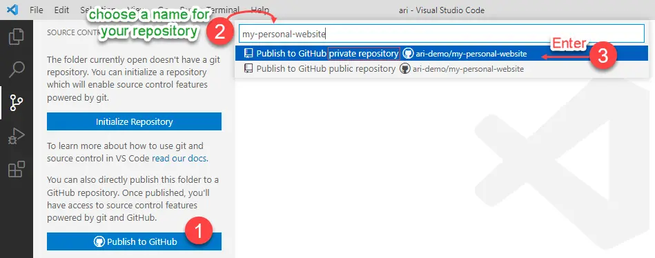
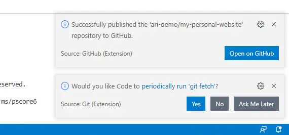
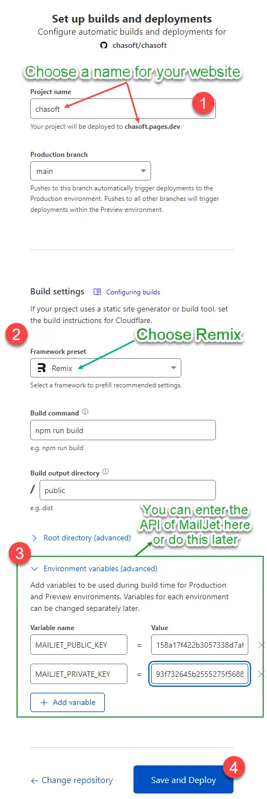

# Deployment


Deploy a serverless to Cloudflare Pages can not be easier. First you need to create a [private](../getting-started/faqs.md) GitHub repository and publish your Ari there. The next step is to go to Cloudflare Pages and publish your website with just a few clicks.

:::info
To check whether you declare email *(which is used to register GitHub)* with Git or not, try following command:
```
git config --global user.email
```
If it returns your email address, then everything should be fine to continue.
:::

Assumes that you have had your local development environment already. Follows the instructions below to get started:

## Publish Ari to GitHub repository

The most easiest way to publish is through Visual Studio Code.

- Open Visual Studio Code
- Open Ari folder *(File -> Open Folder...)*
- Go to Source Control page *(or press Ctrl+Shift+X)*
- Click **`Publish to GitHub`** button

<details>
<summary>Screenshots</summary>

<div style={{textAlign: 'center'}}>





</div>

:::warning
You must publish your Ari to **`GitHub private repository`**.
:::

</details>

## Deploy to Cloudflare pages

- Sign in to Cloudflare
- Go to Pages > Create a project > Connect to Git
- You would need to follow some steps to Authorize Cloudflare to access your GitHub account
- Select a repository *(your newly created repository)* > Click **"Begin setup"** button
- Set up builds and deployments: choose `Remix` as your `Framework preset` > Click `Save and Deploy` button

  <details>
  <summary>Screenshots</summary>
  <div style={{textAlign: 'center'}}>

  

  </div>
  </details>

One minute later ⚡ you have a website deployed globally at the address `https://{yourname}.pages.dev`, if you own a domain, add it later in minutes. 🎉 Enjoy your website! Promote our website through any channels you have available!

## Video tutorial

```mdx-code-block
import LiteYouTubeEmbed from 'react-lite-youtube-embed';

<div className="video-container">
  <LiteYouTubeEmbed
    id="YEFoHFK5ydU"
    playlist={false}
    title="Publish Ari to GitHub and Deploy to Cloudflare Pages"
    poster="hqdefault"
    noCookie={true}
  />
</div>
```