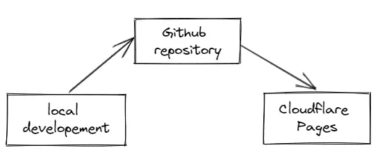

# Deployment to Cloudflare Pages

Ari 1.x only support to deploy to Cloudflare Pages. The deployment process is very great simple and easy as decribed below.

1. You have your own local development environment, modify Ari as you wish. Tested locally.

2. Create a github repository _**(private repository)**_ and push Ari to your github repository.

3. Connect your github account to Cloudflare Pages.

And everything would be executed automatically. Everytime you update your github, your Ari would be deployed to Cloudflare Pages automatically.

:::info

**Ari** could be ported to run on any serverless platform _(thanks to [Remix Web Framework](https://remix.run/))_ such as:

* AWS
* Cloudflare worker
* FlyIo
* Netlify
* Vercel
* Any Express server

but for the very first version of **Ari** _(1.x)_, we only support to deploy to **`Cloudflare Pages`**. The reason is that **Ari** (1.x) focus on `standalone spirit` and `effordable spirit`. You would have a powerful serverless website for `FREE` when deploy to `Cloudflare Pages`

:::