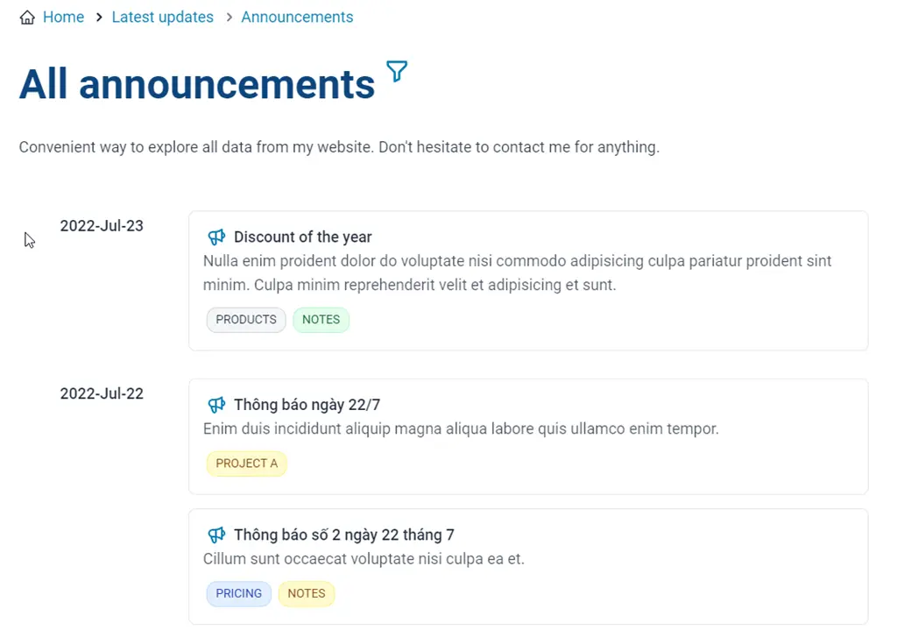
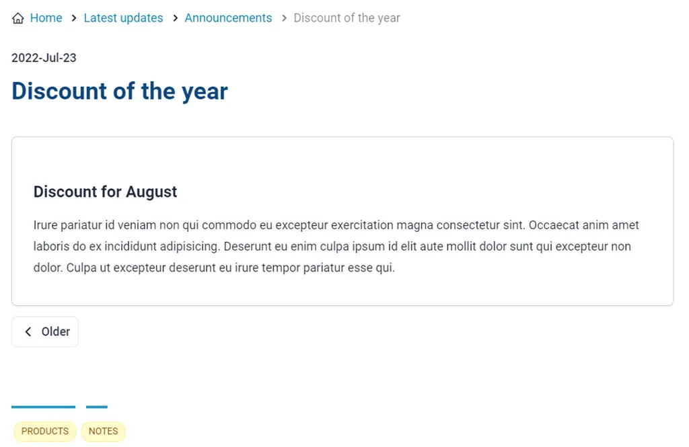
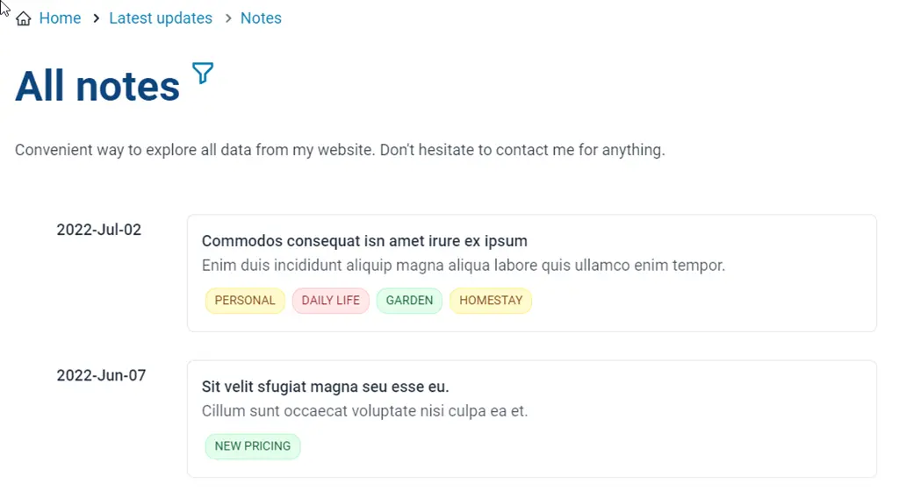
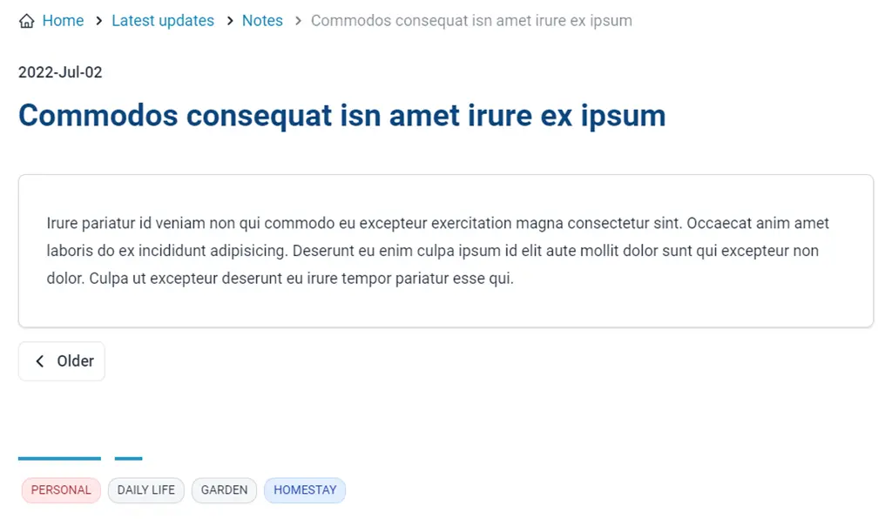
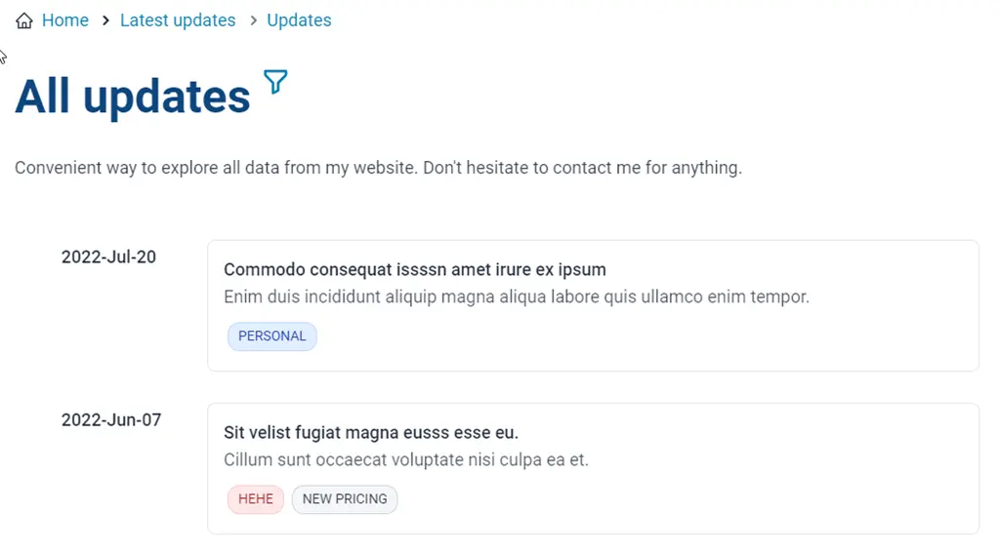
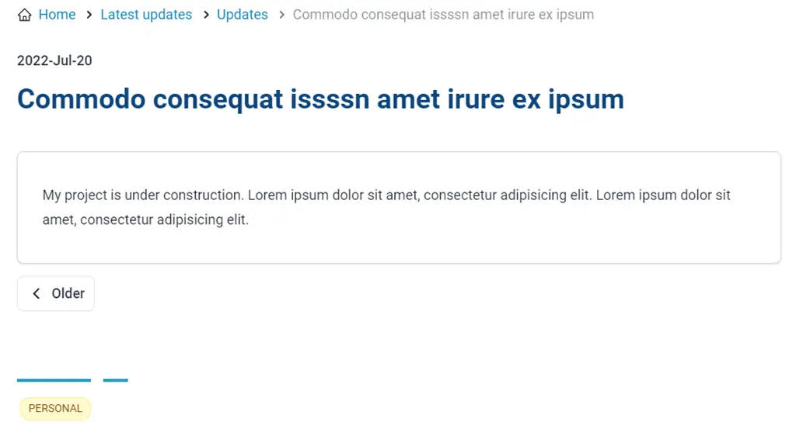

import Tabs from '@theme/Tabs';
import TabItem from '@theme/TabItem';

# Latest updates

`Latest updates` is one of the most powerful features available in Ari. It helps your visitors to go around and explore all your content easier. You can access this page access http://your-domain.com/latest-updates or click `What's new` icon on the top right of your website.

**What do you have in your personal website?** _(not counting pages around your website. Eg: terms of use, disclaimer, payment guides...)_

- Your `Porfolios`, the event when your portfolio started, or when it was accomplished.
- Your `Blog posts`, all kinds of blog posts, many categories, countless tags to classify...
- Your `Announcements`. As your personal website, you want to announce something such as new products, new sales policies...
- Your `Notes`. As your personal website, you want to note something which is unofficial but still want your visitors to know about it.
- Your `Updates`. Or you can call it your own tweets. If you want to tell your visitors something about your process about your portfolio, about your blog post, or anything, but it would not be a note or an announcement.

And with a lot of information, `Lastest Updates` is a convenient way to explore.

## Announcements, Notes, and Updates

Ari comes with 3 additional information types which helps you to express yourself better than any other exited system. They are sharing the same type declaration.

<details>

<summary>Type declaration</summary>

```ts
type UpdateItem = {
  /**
   * if you have a lot of updating,
   * then, this information is used as `tag`
   * which help you distinguish between updates
   * and also help you to filter the updates when necessary
   */
  type?: SectionUpdate
  title: string
  description?: string
  /**
   * you can set more than 1 language
   * when you are too lazy to do the translation
   * this helps your site not be empty in a specific supported language
   */
  language: Language[]
  tags: string[]
  categories: string[]
  slug?: string
  date: string
  /**
   * This is additional field for any purpose in the future
   * For now, it is used to determine 2 statuses of porfolioItem
   * extra = "started" | "finished"
   */
  extra?: string
  /**
   * You can use markdown text here
   */
  content?: MarkdownText
}

type SectionUpdate = "announcements" | "blog" | "portfolio" | "updates" | "notes"

type MarkdownText = string
```

</details>

### Announcements

All your announcements are stored at **`app\data\pages\announcements.server.ts`**

<Tabs>
<TabItem value="Examples">

```ts
const data: UpdateItem[] = [
{
		type: "announcements",
		title: "Announcements for 22-Jul-2022",
		description: "Enim duis incididunt aliquip magna aliqua labore quis ullamco enim tempor.",
		categories: [],
		tags: ["project a"],
		language: ["en"],
		date: "2022-07-22",
		content:
`
### Notice

Irure pariatur id veniam non qui commodo eu excepteur exercitation magna consectetur sint. Occaecat anim amet laboris do ex incididunt adipisicing. Deserunt eu enim culpa ipsum id elit aute mollit dolor sunt qui excepteur non dolor. Culpa ut excepteur deserunt eu irure tempor pariatur esse qui.
`
	}
]
```

</TabItem>
<TabItem value="Screenshots">

<div style={{textAlign: "center"}}>





</div>

</TabItem>
</Tabs>

### Notes

All your notes are stored at **`app\data\pages\notes.server.ts`**

<Tabs>
<TabItem value="Examples">

```ts
const data: UpdateItem[] = [
{
		type: "notes",
		title: "Commodos consequat isn amet irure ex ipsum",
		description: "Enim duis incididunt aliquip magna aliqua labore quis ullamco enim tempor.",
		tags: ["daily life", "garden", "homestay"],
		categories: ["personal"],
		language: ["en"],
		date: "2022-07-02",
		content:
			`
Irure pariatur id veniam non qui commodo eu excepteur exercitation magna consectetur sint. Occaecat anim amet laboris do ex incididunt adipisicing. Deserunt eu enim culpa ipsum id elit aute mollit dolor sunt qui excepteur non dolor. Culpa ut excepteur deserunt eu irure tempor pariatur esse qui.
`
	}
]
```

</TabItem>
<TabItem value="Screenshots">

<div style={{textAlign: "center"}}>





</div>

</TabItem>
</Tabs>

### Updates

All your updates are stored at **`app\data\pages\updates.server.ts`**

<Tabs>
<TabItem value="Examples">

```ts
const data: UpdateItem[] = [
{
		type: "updates",
		title: "Commodo consequat issssn amet irure ex ipsum",
		description: "Enim duis incididunt aliquip magna aliqua labore quis ullamco enim tempor.",
		tags: ["personal"],
		categories: [],
		language: ["en"],
		date: "2022-07-20",
		content:
`
Irure pariatur id veniam non qui commodo eu excepteur exercitation magna consectetur sint. Occaecat anim amet laboris do ex incididunt adipisicing. Deserunt eu enim culpa ipsum id elit aute mollit dolor sunt qui excepteur non dolor. Culpa ut excepteur deserunt eu irure tempor pariatur esse qui.
`
	}
]
```

</TabItem>
<TabItem value="Screenshots">

<div style={{textAlign: "center"}}>





</div>

</TabItem>
</Tabs>

## Video tutorial

```mdx-code-block
import LiteYouTubeEmbed from 'react-lite-youtube-embed';

<div className="video-container">
  <LiteYouTubeEmbed
    id="X8T4qx_VO50"
    playlist={false}
    title="What's new - great feature of your personal website"
    poster="hqdefault"
    noCookie={true}
  />
</div>
```