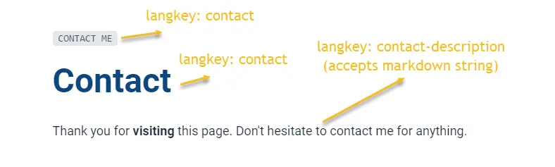
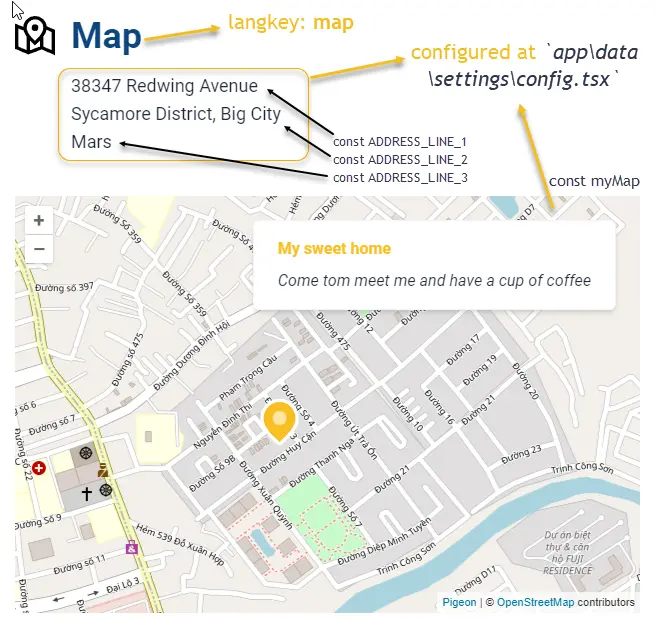
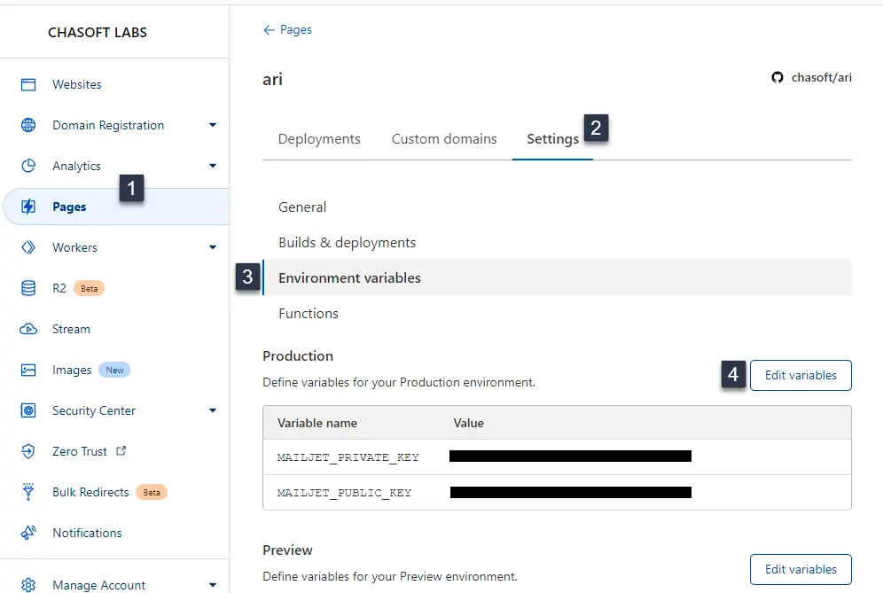

import Tabs from '@theme/Tabs';
import TabItem from '@theme/TabItem';

# Contact

**Contact page** comes with 3 sections: `ContactInfoBox`, `ContactMap` and `ContactForm`. Following instructions below to customize your contact page.

## Header block

Language keys used for header block of contact page are `contact`, `contact-me`, `contact-description` which located at **`app\languages\contactLangTable.ts`**. 

<Tabs>
<TabItem value="Usage">

```tsx
<HeaderBlock
  title={t("contact")}
  subTitle={t("contact-me")}
  description={t("contact-description")}
/>
```

</TabItem>
<TabItem value="Note">

`contact-description` accepts markdown text.

</TabItem>
<TabItem value="Screenshots">

<div style={{textAlign: 'center'}}>



</div>

</TabItem>
</Tabs>

## Information box (InfoBox)

There are two variant of InfoBox: `Boxes` and `Block`. You can choose one of them by updating the settings in `config.ts`

```ts title="app\data\settings\config.tsx"
...
type ContactInfoType = "Block" | "Box"
const contactInfoType: ContactInfoType = "Block"
...
```

Information box including 3 essentials information. They are:

1. Email 
2. Phone number
3. Address

`Phone number` and `address` are declared at **`/app/data/settings/config.tsx`**

```ts title="app\data\settings\config.tsx"
...
/**
 * the very first phone number would be used everywhere when 
 * we need to display a contact phone number
 */
export const YOUR_PHONE = [
	{
		groupName: "office",
		numbers: [
			"447-569-8326",
		]
	},
	{
		groupName: "business",
		numbers: [
			"941-860-3565",
		]
	}
]

//Address info used for `ContactMap`
export const ADDRESS_LINE_1 = "38347 Redwing Avenue"
export const ADDRESS_LINE_2 = "Sycamore District, Big City"
export const ADDRESS_LINE_3 = "Mars"
...
```

And email address is declared at **`/app/data/settings/config.tsx`**

```ts title="app\data\settings\config.tsx"
...
//email to receive email sent by `contact form` (sent to)
export const YOUR_EMAIL = [
	"support@your-domain.com",
]
...
```

and the language located at **`app\languages\contactLangTable.ts`**

## Map

Contact page comes with a map which let you show your address _(a free service of OpenStreetMap)_.

Translation for contact map located at **`app\languages\contactLangTable.ts`**

<Tabs>
<TabItem value="Map settings">

```ts title="app\data\settings\config.tsx"
...
//If you don't want map to be showed, set below to `false`
export const showContactMap = true

//If `showContactMap` is true, then, whether you want to show/hide address?
export const showAddress = false

/**
 * Map Details
 * translation -> `/languages/contactLangTable.ts`
 */
const myMap = [
  {
    anchor: [10.8161863, 106.7782831] as Point,
    title: "my-sweet-home",
    description: "come-to-meet-me-and-have-a-cup-of-coffee",
    color: "#fbbf24",
    slug: "https://www.google.com/maps/place/Block+C1+-+Chung+c%C6%B0+Gia+Ho%C3%A0/@10.8167543,106.7772373,17z/data=!4m5!3m4!1s0x317527325eccf3fb:0xfff7d976148461f6!8m2!3d10.8145856!4d106.7771547",
    isDefault: true
  }
]
...
```

</TabItem>
<TabItem value="Screenshots">

<div style={{textAlign: 'center'}}>



</div>

</TabItem>
</Tabs>

## Contact Form

Ari use MailJet to send email. Why? MailJet has free plan which allow to send `200` emails per day and accumulate up to `6,000` emails per month. If your personal website has more than 200 contact per day. It should be great to pay for the service.

Register an account at [MailJet](https://app.mailjet.com/signup?lang=en_US). To get the API, go to https://app.mailjet.com/account/apikeys to get API keys.

**Step 1**: declare the email which you used to open account with MailJet

```ts title="app\data\settings\config.tsx"
...
//email which you use to created mailjet account (Sent from)
export const YOUR_MAILJET_EMAIL = "mailjet@your-domain.com"
...
```

**Step 2**: declare the API key and secret key

<Tabs>
<TabItem value="Local environment">

Create a file called `.dev.vars` in root folder`/` _(the folder which `package.json` located)_ and provided the API key and secret key.

```
MAILJET_PUBLIC_KEY=....
MAILJET_PRIVATE_KEY=....
```

</TabItem>
<TabItem value="Production environment">

Configure the API key and secret key as `environment variables`.

<div style={{textAlign: 'center'}}>



</div>

</TabItem>
</Tabs>

:::info

Dislaimer: I have no relationship with MailJet, it is a good service to use. That's all

:::

## Video tutorial

```mdx-code-block
import LiteYouTubeEmbed from 'react-lite-youtube-embed';

<div className="video-container">
  <LiteYouTubeEmbed
    id="YEFoHFK5ydU"
    playlist={false}
    title="Configure contact page"
    poster="hqdefault"
    noCookie={true}
  />
</div>
```