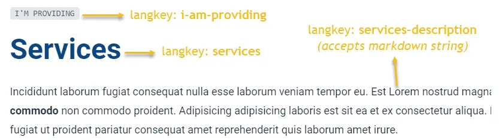

import Tabs from '@theme/Tabs';
import TabItem from '@theme/TabItem';

# Services

Services is a premade page and you could call it whatever you want. I mean you could call it (renamed it) `products` or `pricing` or `whatever` but I think `services` is the best name for it.

## Header block

Language keys used for header block of services page are `services`, `i-am-providing`, `services-description` which located at **`app\languages\servicesLangTable.ts`**. 

<Tabs>
<TabItem value="Usage">

```tsx
<HeaderBlock
  title={t("services")}
  subTitle={t("i-am-providing")}
  description={t("services-description")}
/>
```

</TabItem>
<TabItem value="Note">

`services-description` accepts markdown text.

</TabItem>
<TabItem value="Screenshots">

<div style={{textAlign: 'center'}}>



</div>

</TabItem>
</Tabs>

## Additional content blocks

 Services page is located at **`app\routes\__layout\services.tsx`**. It is safe for you to edit the lines between the markers. 

<Tabs>
<TabItem value="File">

```ts title="app\routes\__layout\services.tsx"
...
{
  /*********************************
  * 
  *   START PAGE CONTENT 
  * 
  ********************************/
}

//place your content for services here

{
  /*********************************
  * 
  *   END PAGE CONTENT 
  * 
  ********************************/
}
...
````

</TabItem>
<TabItem value="Content blocks">

Recommended content blocks for your services page

- [FaqsBlock](../content-blocks.mdx#faqsblock)
- [Features](../content-blocks.mdx#features)
  + [Features.Simplicity](../content-blocks.mdx#featuressimplicity)
  + [Features.Blocks](../content-blocks.mdx#featuresblocks)
  + [Features.Picture](../content-blocks.mdx#featurespicture)
  + [Features.Art](../content-blocks.mdx#featuresart)

- [PricingTable](../content-blocks.mdx#pricingtable)
  + [PricingTable.List](../content-blocks.mdx#pricingtablelist)
  + [PricingTable.TwoColumn](../content-blocks.mdx#pricingtabletwocolumn)
  + [PricingTable.ThreeColumn](../content-blocks.mdx#pricingtablethreecolumn)

</TabItem>
<TabItem value="Examples">

```tsx
<PricingTable.List
  pricingData={pricingList}
  langTable={servicesLangTable}
/>

<Features.Art
  features={servicesFeatures}
  langTable={serviceFeaturesLangTable}
  reverse
/>

<PricingTable.ThreeColumn
  pricingData={pricing3Column}
  langTable={servicesLangTable}
/>

<Features.Picture
  features={servicesFeatures2}
  langTable={serviceFeaturesLangTable}
/>

<PricingTable.TwoColumn
  pricingData={pricing2Column}
  langTable={servicesLangTable}
/>

<FaqsBlock
  langTable={faqsServicesLangTable}
  faqs={faqsServices}
/>
```

</TabItem>
</Tabs>

## Video tutorial

```mdx-code-block
import LiteYouTubeEmbed from 'react-lite-youtube-embed';

<div className="video-container">
  <LiteYouTubeEmbed
    id="X8T4qx_VO50"
    playlist={false}
    title="Introduction about Services page"
    poster="hqdefault"
    noCookie={true}
  />
</div>
```