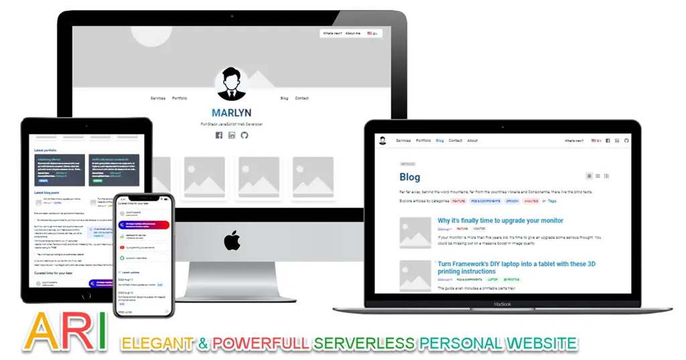

# Introduction

<div style={{textAlign: 'center'}}>



</div>

⚡️ Ari will help you ship a **lightning fast website** that you will be confident.

💸 Building maintainable website is hard and expensive. Instead, **focus on your content** and just write Markdown files.

💥 Ready for more? Use **advanced features** like i18n, **“what's new”** information central.

🧐 Ari is a **Server-side Rendering** website. It builds a **multi-pages application** with fast client-side navigation, leveraging the full power of **React** to make your site interactive. It provides out-of-the-box **blogging features** but can be used to create **your valuable personal website site** *(or it could be a bioLink, personal sharing platform, blogger, showcase, etc which all power your private interests or business needs)*.

## Ari: Powerful Serverless Personal Website

In this video, the author will show you a brief introduction about Ari and its features.

```mdx-code-block
import LiteYouTubeEmbed from 'react-lite-youtube-embed';

<div className="video-container">
  <LiteYouTubeEmbed
    id="X8T4qx_VO50"
    playlist={false}
    title="Ari: Powerful Personal Website Made Easy"
    poster="hqdefault"
    noCookie={true}
  />
</div>

```
## Features {#features}

Ari is built with high attention to `standalone application` which all data are stored in GitHub repository, no database, no backup, but still having the power of dynamic websites. Thanks to [Remix Web Framework](https://remix.run).

- 💯 **Full-featured personal website**:
  - Homepage
  - Portfolio
  - Services
  - Blog
  - Pricing
  - Contact
- ✂️ **Centralize personal updates**:
  - Simple and flexible structure to express any kind of personal information
    (announcements, notes, updates)
  - Easily to explore all information via filtering by tags, categories, data types
- 🎯 **SEO-friendly**:
  - Server-side rendering is SEO friendly.
  - High performance with very high Page Speed scores.
- 📝 **Powered by MDX**:
  - Write interactive components via JSX and React embedded in Markdown.
  - 30+ content components for your arrangement with ideas.
- 🌍 **Internationalization (i18n)**: Translate your site in multiple locales, the easy way.
- ⚛️ **Built with 💚 and [Remix](https://remix.run)**:
  - Extendable and customizable with React
  - Working with/without JavaScript enabled.
  - Standalone website

Ari is born to be a better personal website for everyone: `Simple`, `Dynamic` and `lightning-fast`.

- ⚡️ **Lightning-fast**. Ari is built using Remix Web Framework, focus in web fundamental.
- 🦖 **Accessible**. Attention to accessibility, making your site equally accessible to all users.

## Release history {#release-history}

```
2022-Aug-23: Initial release of Ari (v1.0.0)
```

## Why Ari? {#whyAri}

- Built by Remix Web Framework. Great framework to build better website and apps.
- 30+ content blocks. Core pages are connected. All fully documented with guides and video tutorials.
- Fully support multi-languages *([i18n](https://en.wikipedia.org/wiki/Internationalization_and_localization))*
- You would learn about web-development with best practices when working with Ari to build your own personal website *(great for explorer, students, or anyone who loves to start learning about web-development the easy way)*
- We provide add-on services such as installation, setup, customization...

Finally, you would have a very fast website which helps you to express everything *(oh, your real personal website)* to support your job, your personal business, your personal interests. You are confident to have a name card with only your name and a domain on it, and say: *"let you check my website for details"*.

Let's start your online presence today.
## Is something missing? {#something-missing}

If you find issues with the documentation or have suggestions on how to improve the documentation or the project in general, please [file an issue](https://github.com/chasoft/docs.chasoft.net) for us, or send a tweet mentioning the [@vBizChain](https://twitter.com/vBizChain) Twitter account.

For new feature requests, you can create a post on our [feature requests board (Canny)](/feature-requests), which is a handy tool for road-mapping and allows for sorting by upvotes, which gives the core team a better indicator of what features are in high demand, as compared to GitHub issues which are harder to triage. Refrain from making a Pull Request for new features (especially large ones) as someone might already be working on it or will be part of our roadmap. Talk to us first!