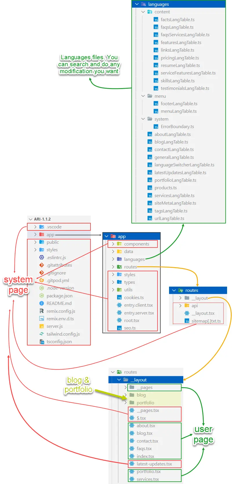
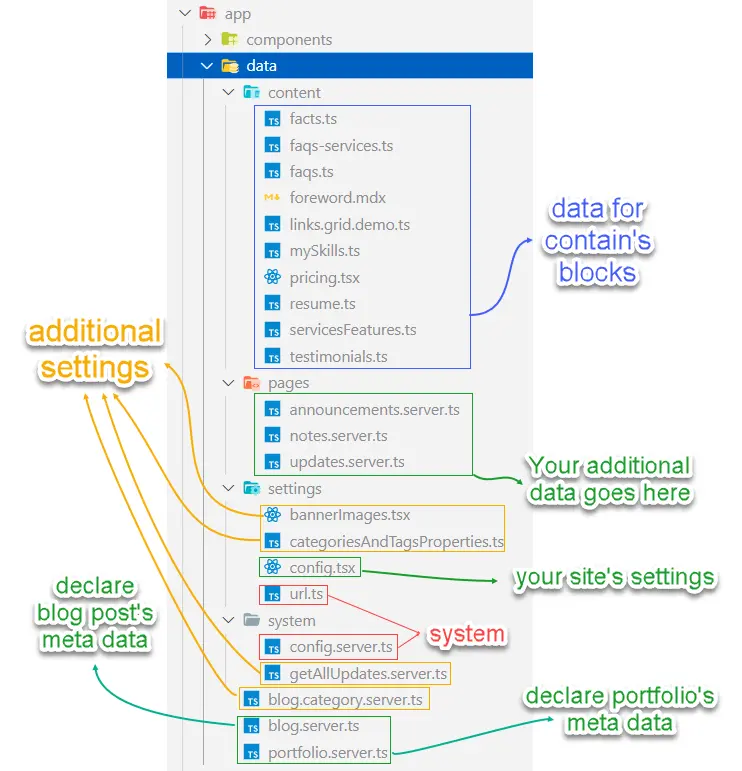
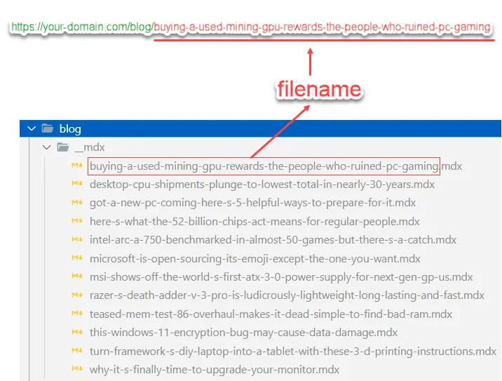
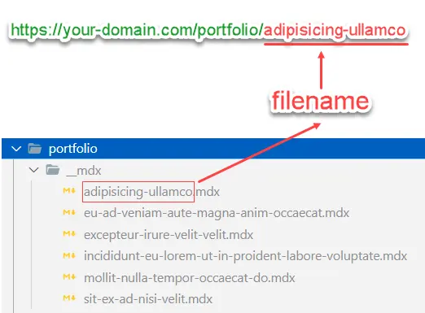

# Files structure

## Root folder

:::info

- **System Pages (in red)**: do not touch these files and folders unless you know what you are doing
- **User Pages (in green)**: where you do the modification. You often need to read [content blocks](../guides/content-blocks.mdx) to know the structure of content blocks. To use them correctly.
- All `.mdx` files are where you write your blog posts/ articles, and they have the most simple syntax. Just take a look, and you will know how simple it is.

:::

## Data folder

**`app\data\`** This is where you:

- config your website
- store display data for your pages *(to serve content blocks)*
- declare your data *(blog posts and/or portfolio articles)*

## Blog folder

**`app\routes\__layout\blog\__mdx\`** This is where you write your blog posts

## Portfolio folder

**`app\routes\__layout\portfolio\__mdx\`** This is where you write your portfolio articles

