import Tabs from '@theme/Tabs';
import TabItem from '@theme/TabItem';
import BrowserWindow from '@site/src/components/BrowserWindow';

# Content blocks

Aris comes with many content blocks *(or designed blocks)* which helps you to present your data/information in pages, blog post or any places you want to.

## Alert

<details>

<summary>Type declaration</summary>

```ts
type AlertProps = {
  alertType?: AlertTagColor
  alignment?: "left" | "right"
  className?: string
  hasShadow?: boolean
  children: React.ReactNode
  /**
   * make your alert looks `art` when skew to the left or to the right
   */
  art?: "right" | "left"
}

type AlertTagColor = number | "gray" | "blue" | "red" | "yellow" | "green" | "random" | "info" | "success" | "warning" | "error"
```

</details>

<Tabs>
<TabItem value="Usage">

```tsx
import Alert from "~/components/Alert"

<Alert alertType="warning">
  Lorem ipsum dolor sit amet, consectetur adip locales justifying information
</Alert>
```

</TabItem>
<TabItem value="Screenshots">

<div style={{textAlign: 'center'}}>

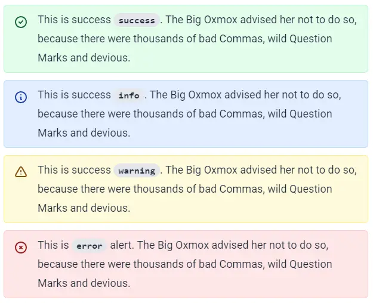

</div>

</TabItem>
</Tabs>

## Align

<details>

<summary>Type declaration</summary>

```ts
type AlignProps = {
  alignment?: "left" | "right" | "2Columns" | "expanded"
  className?: string
  children: React.ReactNode
}
```

</details>

<Tabs>
<TabItem value="Usage">

```tsx
import Align from "~/components/Align"

<Align alignment="2Columns">
Occaecat commodo ullamco nisi exercitation magna dolore et. Aliqua proident nisi ea fugiat et velit cupidatat. Fugiat incididunt aute eu cillum in in amet cupidatat laborum. Minim reprehenderit esse irure culpa. Officia anim pariatur tempor irure.

Amet dolore cillum dolore officia sit eiusmod aliqua Lorem sit excepteur ullamco ea. Eu velit id in Lorem labore voluptate ea non deserunt sit in labore. Dolor cillum nostrud exercitation adipisicing irure..
</Align>
```

</TabItem>
<TabItem value="Screenshots">

<div style={{textAlign: 'center'}}>

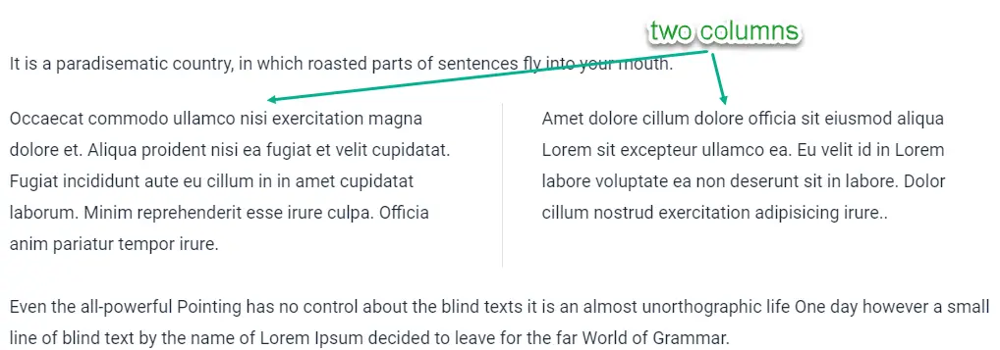

</div>

</TabItem>
</Tabs>

## Facts

<details>

<summary>Type declaration</summary>

```ts
type FactsProps = {
  facts: FactsGroup
  langTable: LangTable
}

type FactsGroup = {
  title?: string
  description?: string
  facts: FactItem[]
}

type FactItem = {
  quantity: number,
  title: string
  imageUrl?: string
}
```

</details>

<Tabs>
<TabItem value="Usage">

```tsx
import Facts from "~/components/Facts"

<Facts
  facts={factsInAbout}
  langTable={factsLangTable}
/>
```

</TabItem>
<TabItem value="Data">

```ts
export const factsInAbout: FactsGroup = {
  title: "fact-in-about",
  description: "fact-in-about-description",
  facts: [
    {
      quantity: 10,
      title: "employees",
      imageUrl: "https://your-domain.com/img/elements/icon-award.svg"
    },
    {
      quantity: 250,
      title: "projects",
      imageUrl: "https://your-domain.com/img/elements/icon-award.svg"
    },
    {
      quantity: 100,
      title: "income",
      imageUrl: "https://your-domain.com/img/elements/icon-award.svg"
    },
    {
      quantity: 1000,
      title: "customers",
      imageUrl: "https://your-domain.com/img/elements/icon-award.svg"
    }
  ]
}
```

</TabItem>
<TabItem value="Note">

If you don't use translation, just remove `langTable` property.

```tsx
<Facts
  // highlight-next-line
  facts={factsInAbout}  //just remove this line
  langTable={factsLangTable}
/>
```

</TabItem>
<TabItem value="Screenshots">

<div style={{textAlign: 'center'}}>

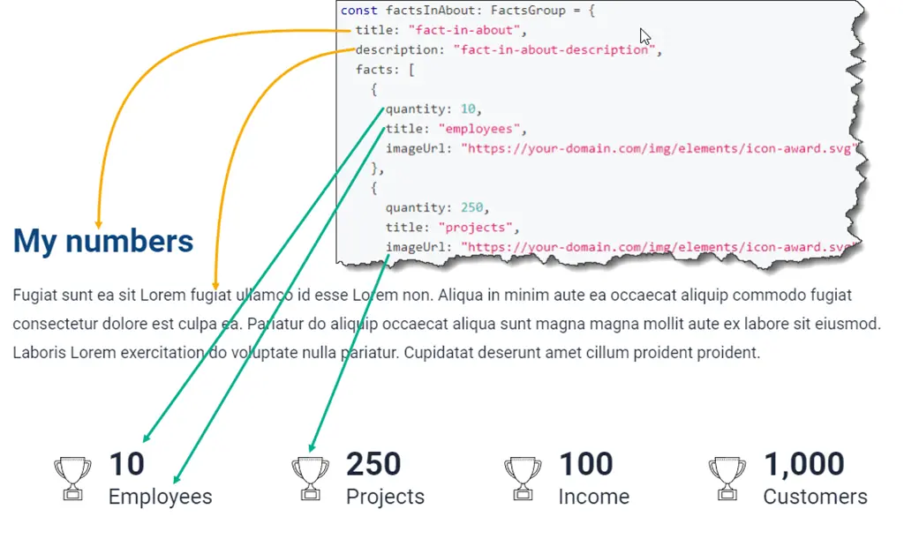

</div>

</TabItem>
</Tabs>

## FaqsBlock

<details>

<summary>Type declaration</summary>

```ts
type FaqsBlockProps = {
  faqs: FAQs[],
  langTable: LangTable
  /**
   * if FaqsBlock is `standalone`, it only display list of questions and answers
   * without `title` and `description`
   */
  standalone?: boolean
}

type FAQs = {
  question: string
  answer: string
  expanded?: boolean
  additional?: {
    question?: string[]
    answer?: string[]
  }
}
```

</details>

<Tabs>
<TabItem value="Usage">

```tsx
import FaqsBlock from "~/components/Faqs"

<FaqsBlock
  langTable={faqsServicesLangTable}
  faqs={faqsServices}
/>
```

</TabItem>
<TabItem value="Data">

```ts
export const faqsServices: FAQs[] = [
  {
    question: "question-1",
    answer: "Annual price is %s, we have lifetime packages only %s.",
    expanded: true,
    additional: {
      answer: ["100", "999"]
    }
  },
  {
    question: "Hello %s, how is everything going?",
    answer: "answer-2",
    additional: {
      question: ["Brian"]
    }
  },
  {
    question: "question-3",
    answer: "answer-3"
  },
]
```

</TabItem>
<TabItem value="Note">

If you don't use translation, just remove `langTable` property and add `standalone` property.

```tsx
<FaqsBlock
  // highlight-next-line
  langTable={faqsServicesLangTable}  //just remove this line
  faqs={faqsServices}
  // highlight-next-line
  standalone  //add this line
/>
```

</TabItem>
<TabItem value="Screenshots">

<div style={{textAlign: 'center'}}>

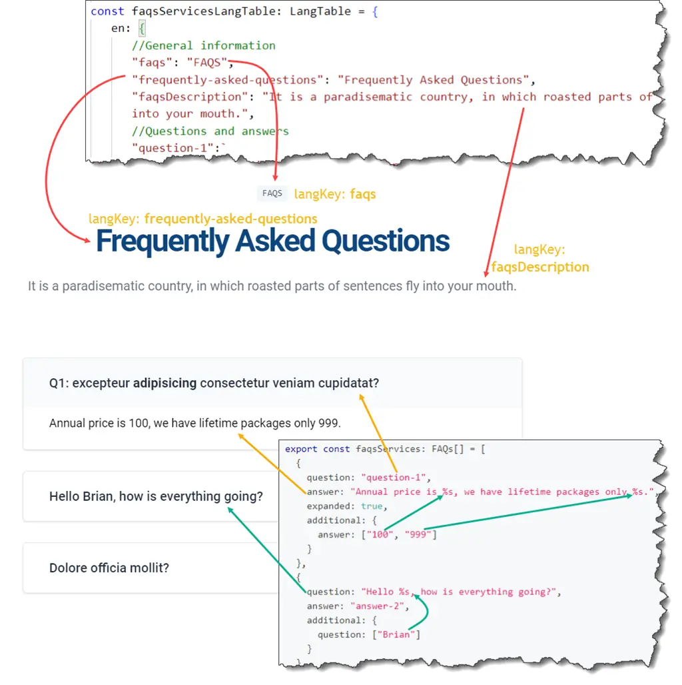

</div>

</TabItem>
</Tabs>

## Features

### Features.Simplicity {#features-simplicity}

<details>

<summary>Type declaration</summary>

```ts
type FeaturesSimplicityProps = {
  features: TFeatures
  langTable: LangTable
}
```

</details>

<Tabs>
<TabItem value="Usage">

```tsx
import Features from "~/components/Features"

<Features.Simplicity
  features={mySkills}
  langTable={skillsLangTable}
/>
```

</TabItem>
<TabItem value="Data">

```ts
export const mySkills: TFeatures = {
  title: "skills-built-for-more-than-10-years",
  subTitle: "my-talents",
  description: "skills-overview",
  items: [
    {
      imageUrl: "https://shuffle.dev/uinel-assets/elements/icon1.svg",
      title: "skill-1",
      description: "skill-1-description",
    },
    {
      imageUrl: "https://shuffle.dev/uinel-assets/elements/icon2.svg",
      title: "skill-2",
      description: "skill-2-description",
      slug:"https://chasoft.net"
    },
    {
      imageUrl: "https://shuffle.dev/uinel-assets/elements/icon3.svg",
      title: "skill-3",
      description: "skill-3-description",
      slug:"/contact"
    },
    {
      imageUrl: "https://shuffle.dev/uinel-assets/elements/icon3.svg",
      title: "skill-4",
      description: "skill-4-description",
    }
  ]
}
```

</TabItem>
<TabItem value="Note">

notes...

</TabItem>
<TabItem value="Screenshots">

<div style={{textAlign: 'center'}}>

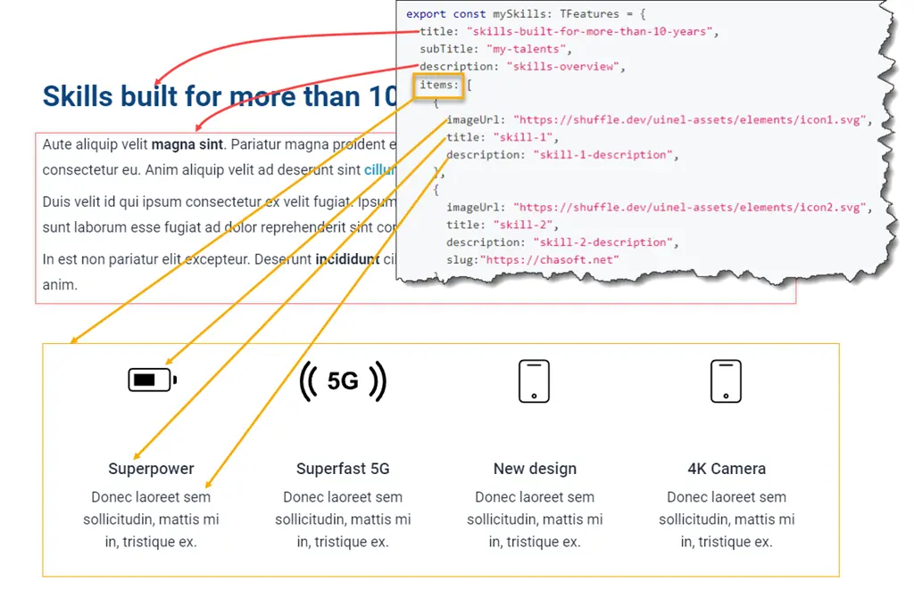

</div>

</TabItem>
</Tabs>

### Features.Blocks {#features-blocks}

<details>

<summary>Type declaration</summary>

```ts
type FeaturesBlocksProps = {
  features: TFeatures
  langTable: LangTable
}
```

</details>

<Tabs>
<TabItem value="Usage">

```tsx
import Features from "~/components/Features"

<Features.Blocks
  features={mySkills}
  langTable={skillsLangTable}
/>
```

</TabItem>
<TabItem value="Data">

```ts
export const mySkills: TFeatures = {
  title: "skills-built-for-more-than-10-years",
  subTitle: "my-talents",
  description: "skills-overview",
  items: [
    {
      imageUrl: "https://shuffle.dev/uinel-assets/elements/icon1.svg",
      title: "skill-1",
      description: "skill-1-description",
    },
    {
      imageUrl: "https://shuffle.dev/uinel-assets/elements/icon2.svg",
      title: "skill-2",
      description: "skill-2-description",
      slug:"https://chasoft.net"
    },
    {
      imageUrl: "https://shuffle.dev/uinel-assets/elements/icon3.svg",
      title: "skill-3",
      description: "skill-3-description",
      slug:"/contact"
    },
    {
      imageUrl: "https://shuffle.dev/uinel-assets/elements/icon3.svg",
      title: "skill-4",
      description: "skill-4-description",
    }
  ]
}
```

</TabItem>
<TabItem value="Note">

notes...

</TabItem>
<TabItem value="Screenshots">

<div style={{textAlign: 'center'}}>

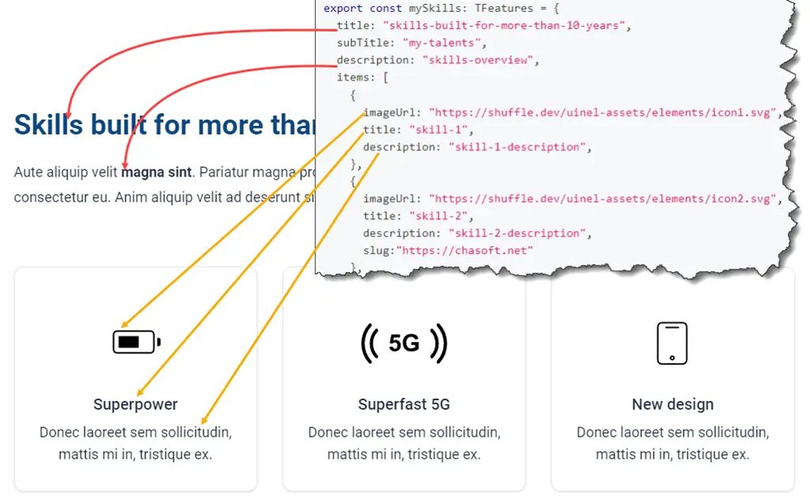

</div>

</TabItem>
</Tabs>

### Features.Picture {#features-picture}

<details>

<summary>Type declaration</summary>

```ts
type FeaturesPictureProps = {
  features: TFeatures
  langTable: LangTable
  /**
   * swap `left to right` and `right to left`
   */
  reverse?: boolean
}
```

</details>

<Tabs>
<TabItem value="Usage">

```tsx
import Features from "~/components/Features"

<Features.Picture
  features={mySkills}
  langTable={skillsLangTable}
/>
```

</TabItem>
<TabItem value="Data">

```ts
export const mySkills: TFeatures = {
  title: "skills-built-for-more-than-10-years",
  subTitle: "my-talents",
  description: "skills-overview",
  items: [
    {
      imageUrl: "https://shuffle.dev/uinel-assets/elements/icon1.svg",
      title: "skill-1",
      description: "skill-1-description",
    },
    {
      imageUrl: "https://shuffle.dev/uinel-assets/elements/icon2.svg",
      title: "skill-2",
      description: "skill-2-description",
      slug:"https://chasoft.net"
    },
    {
      imageUrl: "https://shuffle.dev/uinel-assets/elements/icon3.svg",
      title: "skill-3",
      description: "skill-3-description",
      slug:"/contact"
    },
    {
      imageUrl: "https://shuffle.dev/uinel-assets/elements/icon3.svg",
      title: "skill-4",
      description: "skill-4-description",
    }
  ]
}
```

</TabItem>
<TabItem value="Note">

notes...

</TabItem>
<TabItem value="Screenshots">

<div style={{textAlign: 'center'}}>

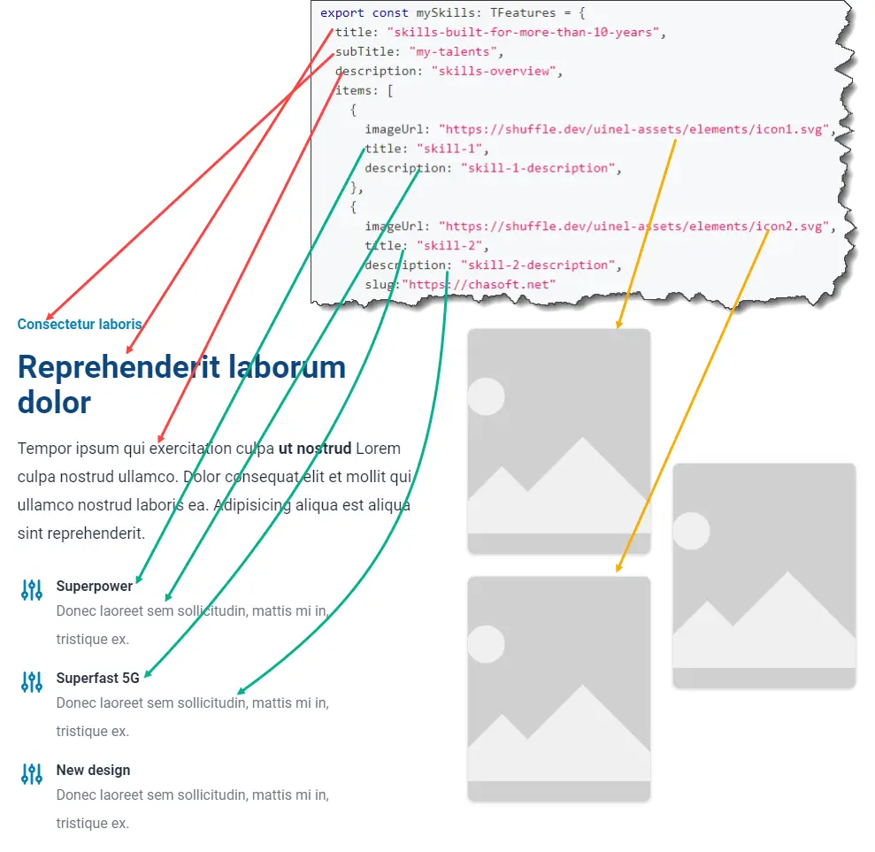

</div>

</TabItem>
</Tabs>

### Features.Art {#features-art}

<details>

<summary>Type declaration</summary>

```ts
type FeaturesArtProps = {
  features: TFeatures
  langTable: LangTable
  /**
   * swap
   */
  reverse?: boolean
}
```

</details>

<Tabs>
<TabItem value="Usage">

```tsx
import Features from "~/components/Features"

<Features.Art
  features={mySkills}
  langTable={skillsLangTable}
/>
```

</TabItem>
<TabItem value="Data">

```ts
export const mySkills: TFeatures = {
  title: "skills-built-for-more-than-10-years",
  subTitle: "my-talents",
  description: "skills-overview",
  items: [
    {
      imageUrl: "https://shuffle.dev/uinel-assets/elements/icon1.svg",
      title: "skill-1",
      description: "skill-1-description",
    },
    {
      imageUrl: "https://shuffle.dev/uinel-assets/elements/icon2.svg",
      title: "skill-2",
      description: "skill-2-description",
      slug:"https://chasoft.net"
    },
    {
      imageUrl: "https://shuffle.dev/uinel-assets/elements/icon3.svg",
      title: "skill-3",
      description: "skill-3-description",
      slug:"/contact"
    },
    {
      imageUrl: "https://shuffle.dev/uinel-assets/elements/icon3.svg",
      title: "skill-4",
      description: "skill-4-description",
    }
  ]
}
```

</TabItem>
<TabItem value="Note">

notes...

</TabItem>
<TabItem value="Screenshots">

<div style={{textAlign: 'center'}}>

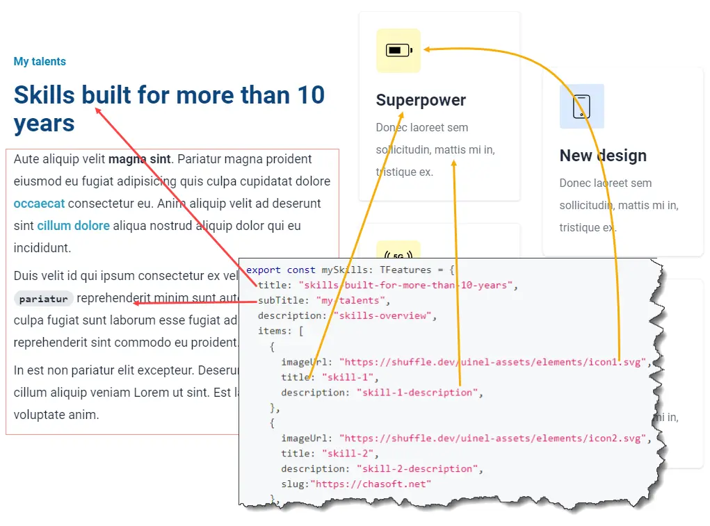

</div>

</TabItem>
</Tabs>

## Highlight

<details>

<summary>Type declaration</summary>

```ts
type HighlightProps = {
  /**
   * background color
   */
  color?: string,
  /**
   * text color
   */
  text?: string,
  children: React.ReactNode
}
```

</details>

<Tabs>
<TabItem value="Usage">

```tsx
import Highlight from "~/components/Highlight"

<Highlight>3rd article</Highlight>

<Highlight color="blue" text="white">
  3rd article
</Highlight>
```

```tsx
Sed ut perspiciatis <Highlight>3rd article</Highlight> unde omnis iste natus error sit voluptatem <Highlight color="blue" text="white">doloremque</Highlight> doloremque laudantium, totam rem aperiam, eaque ipsa quae ab illo <Highlight color="yellow" text="black">explicabo</Highlight> veritatis et quasi architecto beatae vitae dicta sunt explicabo.
```

</TabItem>
<TabItem value="Screenshots">

<div style={{textAlign: 'center'}}>

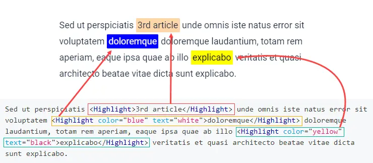

</div>

</TabItem>
</Tabs>

## Image

Display a image based on screen size. `mobile` for screen size `>= 640px`. `desktop` for screen size `> 640px`.

<details>

<summary>Type declaration</summary>

```ts
type ImageProps = JSX.IntrinsicElements["img"] & {
  srcList: ImgSrcSet,
  rounded?: "sm" | "md" | "lg" | "xl" | "2xl"
  wfull?: boolean,
  hfull?: boolean
}

type ImgSrcSet = {
  mobile: string
  desktop?: string
  description?: string
}
```

</details>

<Tabs>
<TabItem value="Usage">

```tsx
import Image from "~/components/Image"

<Image
  srcList={image}
  className="bg-slate-100 w-full"
  alt=""
/>
```

</TabItem>
<TabItem value="Data">

```ts
export const image = {
  mobile: "/img/background/image1.jpg",
  desktop: "/img/background/image2.jpg",
  description: "image 1"
}
```

</TabItem>
<TabItem value="Note">

This component is flexible for it is extended from `img` tag and it can receive `styles` properties

</TabItem>
</Tabs>

## LatestBlogPosts {#latest-blog-posts}

<details>

<summary>Type declaration</summary>

```ts
type LatestBlogPostsProps = {
  showTitle?: boolean
  display?: Display
  /**
   * max is 6
   */
  limit?: number,
  showAsColumn?: boolean
}
```

</details>

<Tabs>
<TabItem value="Usage">

```tsx
import LatestBlogPosts from "~/components/LatestBlogPosts"

<LatestBlogPosts
  display={["image", "description"]}
  limit={2}
  showAsColumn
/>
```

</TabItem>
<TabItem value="Screenshots">

<div style={{textAlign: 'center'}}>

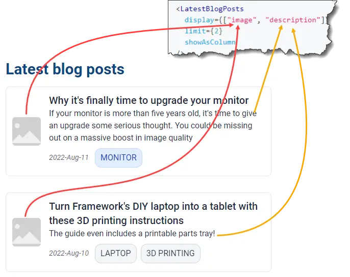

</div>

</TabItem>
</Tabs>

## LatestContent {#latest-content}

You can extract and display latest update by `block` or by `link`

<details>

<summary>Type declaration</summary>

```ts
/**
 *  LatestContent.Note
 *  LatestContent.Update
 *  LatestContent.Announcement
 */
type LatestBlockProps = { alignment?: "left" | "right" }

/**
 *  LatestContent.NotesLink
 *  LatestContent.UpdateLink
 *  LatestContent.AnnouncementLink
 */
type LatestLinkProps = {/* empty */}
```

</details>

<Tabs>
<TabItem value="Usage">

```tsx
import LatestContent from "~/components/LatestContent"

<LatestContent.Note />
<LatestContent.Update />
<LatestContent.Announcement />

<LatestContent.NotesLink />
<LatestContent.AnnouncementLink />
<LatestContent.UpdateLink />
```

```tsx
View latest announcement <LatestContent.AnnouncementLink /> for details.
```

</TabItem>
<TabItem value="Screenshots">

<div style={{textAlign: 'center'}}>

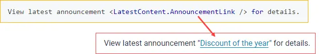

</div>

<div style={{textAlign: 'center'}}>

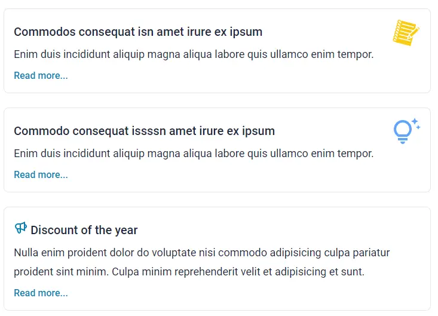

</div>

</TabItem>
</Tabs>

## LatestPortfolio {#latest-portfolio}}

<details>

<summary>Type declaration</summary>

```ts
type LatestPortfolioProps = {
  showTitle?: boolean
  display?: Display
  limit?: number
}
```

</details>

<Tabs>
<TabItem value="Usage">

```tsx
import LatestPortfolio from "~/components/LatestPortfolio"

<LatestPortfolio
  display={["image", "description"]}
  limit={2}
/>
```

</TabItem>
<TabItem value="Screenshots">

<div style={{textAlign: 'center'}}>

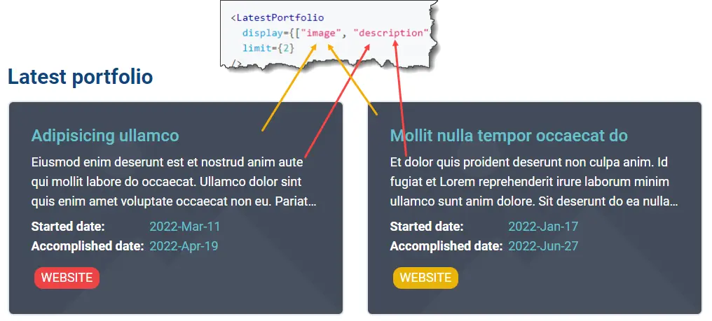

</div>

</TabItem>
</Tabs>

## Link

If you want a `link`, let you use Link component. Or if the target is `internal links`, you must use this component, or multi-language feature not working.

<details>

<summary>Type declaration</summary>

```ts
type LinkProps = {
  to: string
  className?: string
  children: string
}
```

</details>

<Tabs>
<TabItem value="Usage">

```tsx
import Link from "~/components/Link"

<Link to="/blog">Blog</Link>
```

</TabItem>
</Tabs>

## LinksGrid {#links-grid}

<details>

<summary>Type declaration</summary>

```ts
type LinksGridProps = {
  links: LinkMeta[]
  className?: string
}

type LinkMeta = {
  /**
   * if you set a type for a link
   * we will show an icon for the link (default icon)
   * if you don't set imageUrl.
   */
  type?: LinkMetaType
  title: string,
  description?: string
  slug: string,
  iconPicture?: string,
  decoration?: {
    /**
     * we will fill gradient the background
     * 1st & 2nd is background gradient
     * 3rd is text-color
     */
    backgroundColor?: [string, string, string]
    isTextCenter?: boolean
    isBold?: boolean
    isItalic?: boolean
    isDownloadable?: boolean
  }
}
```

</details>

<Tabs>
<TabItem value="Usage">

```tsx
imort LinksGrid from "~/components/LinksGrid"

<LinksGrid links={linksGrid} />
```

</TabItem>
<TabItem value="Data">

```ts
export const linksGrid: LinkMeta[] = [
  {
    title: "link1",
    slug: "/about",
    iconPicture: "/img/background/placeholder.svg"
  },
  {
    title: "link2",
    slug: "/terms-of-service",
    iconPicture: "/img/background/placeholder.svg"
  },
  {
    title: "link3",
    slug: "https://twitter.com/",
    iconPicture: "/img/background/placeholder.svg"
  },
  {
    title: "link4",
    slug: "/contact",
    iconPicture: "/img/background/placeholder.svg",
  }
]
```

</TabItem>
<TabItem value="Note">

notes...

</TabItem>
<TabItem value="Screenshots">

<div style={{textAlign: 'center'}}>

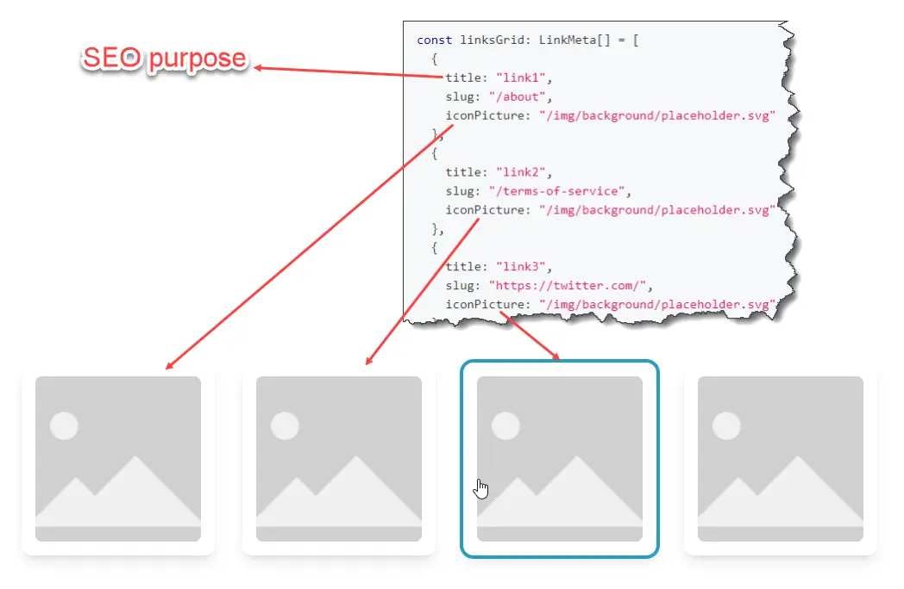

</div>

</TabItem>
</Tabs>

## LinksList {#links-list}

<details>

<summary>Type declaration</summary>

```ts
type LinksListProps = {
  links: LinkMeta[]
  className?: string
}

type LinkMeta = {
  /**
   * if you set a type for a link
   * we will show an icon for the link (default icon)
   * if you don't set imageUrl.
   */
  type?: LinkMetaType
  title: string,
  description?: string
  slug: string,
  iconPicture?: string,
  decoration?: {
    /**
     * we will fill gradient the background
     * 1st & 2nd is background gradient
     * 3rd is text-color
     */
    backgroundColor?: [string, string, string]
    isTextCenter?: boolean
    isBold?: boolean
    isItalic?: boolean
    isDownloadable?: boolean
  }
}
```

</details>

<Tabs>
<TabItem value="Usage">

```tsx
import LinksList from "~/components/LinksList"

<LinksList links={linksList}/>
```

</TabItem>
<TabItem value="Data">

```ts
export const linksList: LinkMeta[] = [
  {
    type: undefined,
    title: "Upcoming events",
    description: "Upcoming events",
    slug: "/",
    iconPicture: undefined
  },
  {
    type: "zip",
    title: "All chess matches with comments",
    description: "Collected from 3 millions matches",
    slug: "/",
    iconPicture: undefined,
    decoration: {
      backgroundColor: ["blue", "red", "white"]
    }
  },
  {
    type: "xls",
    title: "Dashboard for lazy man",
    description: "Automate your daily tasks",
    slug: "/",
    iconPicture: undefined,
    decoration: {
      isBold: true,
      isItalic: true
    }
  },
  {
    type: "youtube",
    title: "My programming youtube channel",
    slug: "/contact",
    iconPicture: undefined,
    decoration: {
      isItalic: true
    }
  },
  {
    type: "cv",
    title: "Curriculum vitae of Brian",
    slug: "/files/mycv.pdf",
    iconPicture: "/img/background/placeholder.svg",
    decoration: {
      isDownloadable: true
    }
  },
]
```

</TabItem>
<TabItem value="Note">

notes...

</TabItem>
<TabItem value="Screenshots">

<div style={{textAlign: 'center'}}>

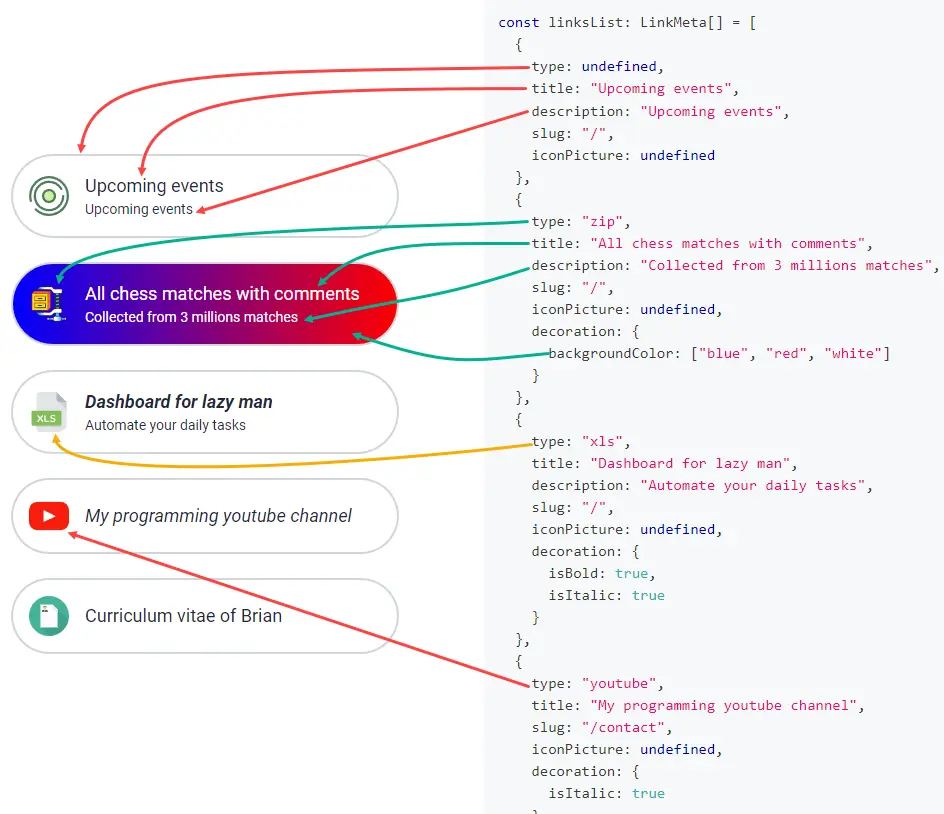

</div>

</TabItem>
</Tabs>

## Map

Map component allows you to show a map and you can also add many custom marker. When hovering over a marker, it information would be display on the top right of the map.

<details>

<summary>Type declaration</summary>

```ts
type MapProps = {
  markers: TMarker[]
  /**
   * zoom is from `4` to `18`
   */
  defaultZoom?: number
  defaultCenter?: Point
  hasPadding?: boolean
  alignment?: "left" | "right" | "expanded"
}

export type TMarker = {
  width?: number
  color?: string
  anchor: Point
  slug?: string
  title?: string
  description?: string
  /**
   * title and description would be displayed
   * as if the marker is on hover if `isDefault` is true
   * Tip: only set 1 marker with `isDefault = true`
   */
  isDefault?: boolean
}

/**
 * [latitude, longitude]
 */
export type Point = [number, number]
```

</details>

<Tabs>
<TabItem value="Usage">

```tsx
import Map from "~/components/Map"

<Map
  alignment="expanded"
  defaultCenter={[10.8161863, 106.7782831]}
  defaultZoom={16}
  hasPadding={true}
  markers={myMarkers}
/>
```

</TabItem>
<TabItem value="Data">

```ts
export const myMarkers: TMarker[] = [
    {
      anchor: [10.8119658,106.7759439],
      slug: "/blog/labore-nisi-cillum-voluptate-consequat-reprehenderit-laborum-deserunt-exercitation",
      title: "Location 1",
      description: "Esse consequat sunt aliqua exercitation consectetur aute amet et consequat velit voluptate."
    },
    {
      anchor: [10.8161863, 106.7782831],
      color: "red",
      slug: "/blog/minim-sunt-velit-do-veniam-velit",
      title: "Location 2",
      description: "Ea duis pariatur officia enim officia nostrud elit ullamco."
    },
    {
      anchor: [10.8172676,106.7824432],
      color: "green",
      slug: "/portfolio/incididunt-eu-lorem-ut-in-proident-labore-voluptate",
      title: "Location 3",
      description: "Voluptate ipsum magna sit nostrud incididunt laborum."
    },
  ]
```

</TabItem>
<TabItem value="Note">

Do not set more than 1 markers with `isDefault={true}` or their content would be overlapped.

**Where to get the `anchor` values?** 

You can use Google Map and, select a location on the map and you will have the anchor

<BrowserWindow
  url={
    <span>
      .../Clarke+Quay/@
      <span style={{ fontWeight: "bold", color: "red" }}>1.29105,103.8439817</span>
      ,
      <span style={{ fontWeight: "bold", color: "blue" }}>17</span>
      z/data=!3m1!5s0x31...
    </span>
  }
>

<div style={{textAlign: 'center'}}>


</div>

</BrowserWindow>

```
  anchor = [1.29105, 103.8439817]
  zoom = 17
```

</TabItem>
<TabItem value="Screenshots">

<div style={{textAlign: 'center'}}>

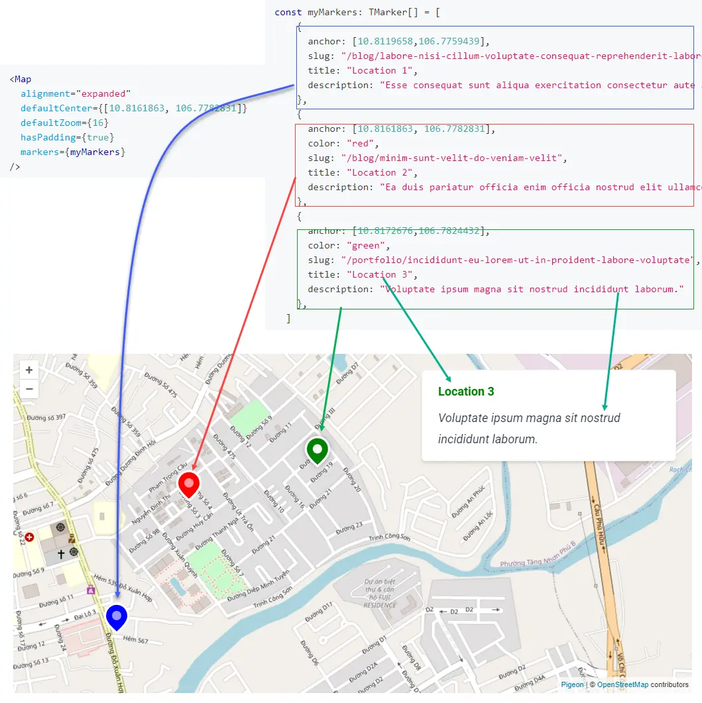

</div>

</TabItem>
</Tabs>

## Markdown

<details>

<summary>Type declaration</summary>

```ts
type MarkdownProps = {
  maxWidth?: "md" | "lg" | "xl"
  textSize?: "md" | "lg" | "xl"
  /**
   * by the fault, the spacing between h1, h2 & h3 is big
   * some cases, we need to decrease the spacing for
   * some inner block of text
   */
  compact?: boolean
  /**
   * split the text into 2 columns
   */
  twoColumns?: boolean,
}
```

</details>

<Tabs>
<TabItem value="Usage">

```tsx
import Markdown from "~/components/Markdown"

<Markdown markdown={`
# H1

**Lorem** ipsum dolor \`sit\` amet, consectetur adipisicing elit, sed do **eiusmod** tempor incididunt ut labore.

|                |ASCII                          |HTML                         |
|----------------|-------------------------------|-----------------------------|
|Single backticks|\`'Isn't this fun?'\`            |'Isn't this fun?'            |
|Quotes          |\`"Isn't this fun?"\`            |"Isn't this fun?"            |
|Dashes          |\`-- is en-dash, --- is em-dash\`|-- is en-dash, --- is em-dash|

`}
/>

```

</TabItem>
<TabItem value="Note">

In most cases, you don't need to use any properties except `markdown`

```tsx
<Mardown markdown="...." />
```

Markdown syntaxes are simple, check this guide for examples: [Markdown](./markdown)

</TabItem>
</Tabs>

## Picture

Display a single picture

<details>

<summary>Type declaration</summary>

```ts
type PictureProps = {
  className?: string
  alt?: string
  src: string
  alignment?: "left" | "right" | "expanded"
  rounded?: "sm" | "md" | "lg" | "xl" | "2xl"
  /**
   * By the default, when alignment is left or right, the width would be 1/2
   * Some cases, you want it to be smaller, which is 1/3
   */
  oneThird?: boolean
}
```

</details>

<Tabs>
<TabItem value="Usage">

```tsx
import Picture from "~/components/Picture"

<Picture
  src="/img/background/placeholder.svg"
  alt="image's description"
  expand
/>
```

</TabItem>
<TabItem value="Note">

**What are the differences between `Image` and `Picture`?**

`Picture` display 1 single image.

`Image` display 1 single image based on the screen size. You can review its [description](#image) for more information.

</TabItem>
</Tabs>

## PricingTable {#pricing-table}

Type declaration is the same for all PriceTable components `PricingTable.List`, `PricingTable.TwoColumn` and `PricingTable.ThreeColumn`

### PricingTable.List {#pricing-table-list}

<details>

<summary>Type declaration</summary>

```ts
type PricingTableListProps = {
  pricingData: PricingData,
  langTable: LangTable
}

type PricingData = {
  title: string
  description: string
  defaultPriceType: PricingType
  packages: PricingPackage[]
  /**
   * if this data is provided, the pricing table would have
   * a list of features listed on the left
   * by this time, the size of `featuresHeading` must equal to `packages.features`
   */
  featuresHeadering?: string[]
  currencyConversion: {
    [key in Language]: {
      ratio: number
      rounding: number
    }
  }
}

type PricingType = "fixed" | "monthly" | "yearly" | "lifetime"

type PricingPackage = {
  name: string
  pricing: { type: PricingType, value: number }[]
  features: {  featureName: string, bulletType: BulletType, quantity?: number }[]
  isPopular?: boolean
  buttonText?: string
  link: string
}

type BulletType = "none" | "available" | "unavailable"
```

</details>

<Tabs>
<TabItem value="Usage">

```tsx
import PricingTable from "~/components/PricingTable"

<PricingTable.List
  pricingData={pricingList}
  langTable={servicesLangTable}
/>
```

</TabItem>
<TabItem value="Data">

```ts
export const pricingList: PricingData = {
  title: "pricingList.title",
  description: "pricingList.description",
  defaultPriceType: "monthly",
  packages: [
    {
      name: "free",
      pricing: [
        { type: "monthly", value: 11 },
        { type: "yearly", value: 100 }
      ],
      features: [
        { featureName: "%s-component-categories", quantity: 1,  bulletType: "available" },
        { featureName: "%s-mobile-components", quantity: 1, bulletType: "unavailable" },
        { featureName: "%s-key-visual", quantity: 1, bulletType: "none" }
      ],
      buttonText: "try-for-free",
      link: "/contact"
    },
    {
      name: "premium",
      pricing: [
        { type: "monthly", value: 19 },
        { type: "yearly", value: 200 }
      ],
      features: [
        { featureName: "%s-component-categories", quantity: 3, bulletType: "available" },
        { featureName: "%s-mobile-components", quantity: 3,bulletType: "available" },
        { featureName: "%s-key-visual", quantity: 3, bulletType: "available" },
        { featureName: "Popular frameworks", bulletType: "unavailable" },
        { featureName: "Support", bulletType: "unavailable" },
        { featureName: "Infinite content", bulletType: "unavailable" },
      ],
      buttonText: "Buy now",
      isPopular: true,
      link: "/contact"
    },
    {
      name: "basic",
      pricing: [
        { type: "monthly", value: 11 },
        { type: "yearly", value: 100 }
      ],
      features: [
        { featureName: "%s-component-categories", quantity: 3, bulletType: "available" },
        { featureName: "%s-mobile-components", quantity: 3,bulletType: "unavailable" },
        { featureName: "%s-key-visual", quantity: 3,bulletType: "none" }
      ],
      buttonText: "buy-now",
      link: "/contact",
      isPopular: false,
    },
    {
      name: "enterprise",
      pricing: [
        { type: "monthly", value: 11 },
        { type: "yearly", value: 100 }
      ],
      features: [
        { featureName: "%s-component-categories", quantity: 3, bulletType: "available" },
        { featureName: "%s-mobile-components", quantity: 3, bulletType: "available" },
        { featureName: "%s-key-visual", quantity: 3, bulletType: "none" }
      ],
      buttonText: "buy-now",
      link: "/contact",
      isPopular: false,
    }
  ],
  currencyConversion: {
    "en": {
      ratio: 1,
      rounding: 2
    },
    "vi": {
      ratio: 24_000,
      rounding: -4
    }
  }
}
```

</TabItem>
<TabItem value="Note">

notes...

</TabItem>
<TabItem value="Screenshots">

<div style={{textAlign: 'center'}}>

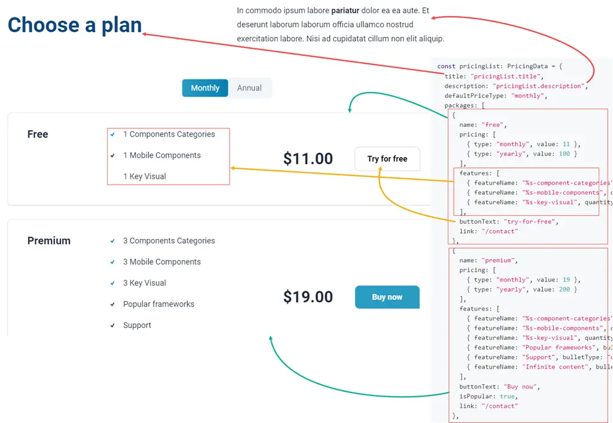

</div>

</TabItem>
</Tabs>

### PricingTable.TwoColumn {#pricing-table-two-column}

<details>

<summary>Type declaration</summary>

```ts
/* The same with `PricingTable.List` */
```

</details>

<Tabs>
<TabItem value="Usage">

```tsx
import PricingTable from "~/components/PricingTable"

<PricingTable.TwoColumn
  pricingData={pricing2Column}
  langTable={servicesLangTable}
/>
```

</TabItem>
<TabItem value="Data">

```ts
export const pricing2Column: PricingData = {
  title: "pricing2Column.title",
  description: "pricing2Column.description",
  defaultPriceType: "yearly",
  packages: [
    {
      name: "standard",
      pricing: [
        { type: "monthly", value: 11 },
        { type: "yearly", value: 100 }
      ],
      features: [
        { featureName: "%s-tb",quantity: 1, bulletType: "available" },
        { featureName: "%s-team-nembers", quantity: 5,bulletType: "available" },
        { featureName: "no", bulletType: "available" },
        { featureName: "yes", bulletType: "none" },
        { featureName: "%s-+projects", quantity: 10, bulletType: "none" },
      ],
      buttonText: "buy-now",
      link: "/contact"
    },
    {
      name: "premium",
      pricing: [
        { type: "monthly", value: 19 },
        { type: "yearly", value: 200 }
      ],
      features: [
        { featureName: "%s-tb", quantity: 3,bulletType: "available" },
        { featureName: "%s-team-members", quantity: 10,bulletType: "available" },
        { featureName: "no", bulletType: "available" },
        { featureName: "yes", bulletType: "unavailable" },
        { featureName: "%s-+projects", quantity: 25,bulletType: "none" },
      ],
      buttonText: "buy-now",
      isPopular: true,
      link: "/contact"
    }
  ],
  featuresHeadering: [
    "cloud-storage",
    "users",
    "teams",
    "commercial-rights",
    "projects"
  ],
  currencyConversion: {
    "en": {
      ratio: 1,
      rounding: 2
    },
    "vi": {
      ratio: 24_000,
      rounding: -4
    }
  }
}
```

</TabItem>
<TabItem value="Note">

notes...

</TabItem>
<TabItem value="Screenshots">

<div style={{textAlign: 'center'}}>

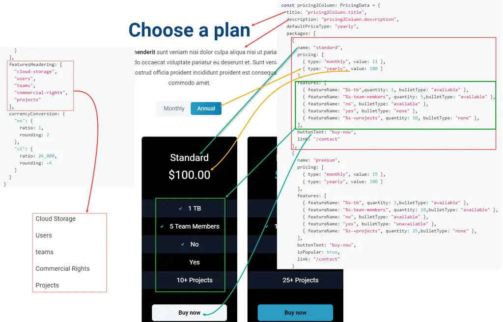

</div>

</TabItem>
</Tabs>

### PricingTable.ThreeColumn {#pricing-table-three-column}

<details>

<summary>Type declaration</summary>

```ts
/* The same with `PricingTable.List` */
```

</details>

<Tabs>
<TabItem value="Usage">

```tsx
import PricingTable from "~/components/PricingTable"

<PricingTable.ThreeColumn
  pricingData={pricing3Column}
  langTable={servicesLangTable}
/>
```

</TabItem>
<TabItem value="Data">

```ts
export const pricing3Column: PricingData = {
  title: "pricing3Column.title",
  description: "pricing3Column.description",
  defaultPriceType: "monthly",
  packages: [
    {
      name: "free",
      pricing: [
        { type: "monthly", value: 11 },
        { type: "yearly", value: 100 }
      ],
      features: [
        { featureName: "%s-component-categories", quantity: 1, bulletType: "available" },
        { featureName: "%s-mobile-components", quantity: 1,bulletType: "available" },
        { featureName: "%s-key-visual",quantity: 1, bulletType: "unavailable" }
      ],
      buttonText: "try-for-free",
      link: "/contact"
    },
    {
      name: "premium",
      pricing: [
        { type: "monthly", value: 19 },
        { type: "yearly", value: 200 }
      ],
      features: [
        { featureName: "%s-component-categories",quantity: 3, bulletType: "available" },
        { featureName: "%s-mobile-components", quantity: 3,bulletType: "available" },
        { featureName: "%s-key-visual", quantity: 3,bulletType: "available" },
        { featureName: "popular-frameworks", bulletType: "none" },
        { featureName: "support", bulletType: "none" },
        { featureName: "infinite-content", bulletType: "none" },
      ],
      buttonText: "buy-now",
      isPopular: true,
      link: "/contact"
    },
    {
      name: "basic",
      pricing: [
        { type: "monthly", value: 11 },
        { type: "yearly", value: 100 }
      ],
      features: [
        { featureName: "%s-component-categories", quantity: 3, bulletType: "available" },
        { featureName: "%s-mobile-components", quantity: 3, bulletType: "available" },
        { featureName: "%s-key-visual", quantity: 3, bulletType: "none" }
      ],
      buttonText: "buy-now",
      link: "/contact",
      isPopular: false,
    }
  ],
  currencyConversion: {
    "en": {
      ratio: 1,
      rounding: 2
    },
    "vi": {
      ratio: 24_000,
      rounding: -4
    }
  }
}
```

</TabItem>
<TabItem value="Note">

notes...

</TabItem>
<TabItem value="Screenshots">

<div style={{textAlign: 'center'}}>

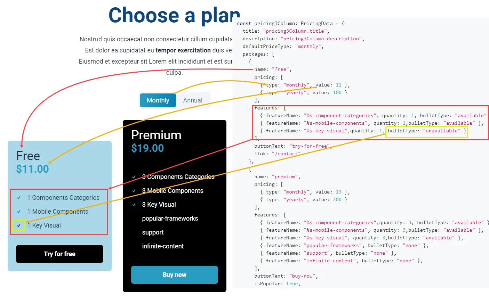

</div>

</TabItem>
</Tabs>

## Resume

### Resume.Experience {#resume-experience}

<details>

<summary>Type declaration</summary>

```ts
type ResumeExperienceProps = {
  resume: ResumeExperience
  langTable: LangTable
}

type ResumeExperience = {
  title: string
  description?: string
  items: {
    logoUrl: string
    jobTitle: string
    companyName: string
    location: string
    contractType: ContractType
    startDate: string
    endDate: string
    description: MarkdownText
  }[]
}

export type ContractType = "full-time" | "part-time" | "freelance"

/**
 * Why don't we set it as `string` type but `MarkdownText = string`
 * That's because we want to indicate that.. we can use markdown text
 * in this field.
 */
export type MarkdownText = string
```

</details>

<Tabs>
<TabItem value="Usage">

```tsx
import Resume from "~/components/Resume"

<Resume.Experience
  resume={experiences}
  langTable={resumeLangTable}
/>
```

</TabItem>
<TabItem value="Data">

```ts
export const experiences: ResumeExperience = {
  title: "experience",
  items: [
    {
      logoUrl: "/img/background/placeholder.svg",
      jobTitle: "senior-developer",
      companyName: "Twitter",
      location: "London",
      contractType: "full-time",
      startDate: "June 2019",
      endDate: "present",
      description: "twitter-description",
    },
    {
      logoUrl: "/img/background/placeholder.svg",
      jobTitle: "middle-developer",
      companyName: "Dropbox",
      location: "London",
      contractType: "part-time",
      startDate: "April 2018",
      endDate: "June 2019",
      description: "dropbox-description",
    },
    {
      logoUrl: "/img/background/placeholder.svg",
      jobTitle: "junior Developer",
      companyName: "Blogger",
      location: "London",
      contractType: "full-time",
      startDate: "December 2017",
      endDate: "March 2018",
      description: "blogger-description",
    },
  ]
}
```

</TabItem>
<TabItem value="Note">

notes...

</TabItem>
<TabItem value="Screenshots">

<div style={{textAlign: 'center'}}>

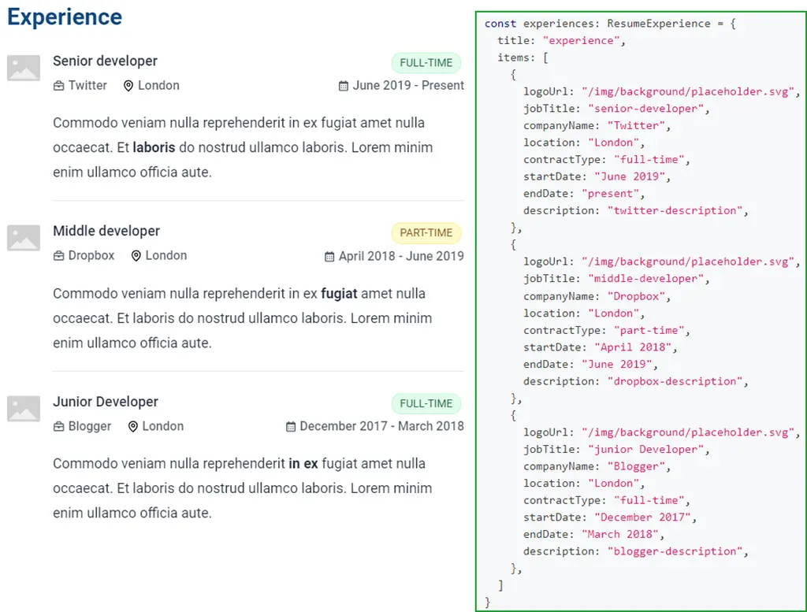

</div>

</TabItem>
</Tabs>

### Resume.Education {#resume-education}

<details>

<summary>Type declaration</summary>

```ts
type ResumeEducationProps = {
  resume: ResumeEducation
  langTable: LangTable
}

type ResumeEducation = {
  title: string
  description?: string
  items: {
    logoUrl: string
    major: string
    schoolName: string
    location: string
    startDate: string
    endDate: string
  }[]
}
```

</details>

<Tabs>
<TabItem value="Usage">

```tsx
import Resume from "~/components/Resume"

<Resume.Education
  resume={education}
  langTable={resumeLangTable}
/>
```

</TabItem>
<TabItem value="Data">

```ts
export const education: ResumeEducation = {
  title: "education",
  items: [
    {
      logoUrl: "https://logospng.org/download/harvard-university/logo-harvard-university-brasao-256.png",
      major: "master-in-software-engineering",
      schoolName: "brunel-university",
      location: "London",
      startDate: "Sep 2017",
      endDate: "May 2019",
    },
    {
      logoUrl: "https://logospng.org/download/harvard-university/logo-harvard-university-brasao-256.png",
      major: "master-in-software-engineering",
      schoolName: "brunel-university",
      location: "London",
      startDate: "Sep 2013",
      endDate: "May 2017",
    }
  ]
}
```

</TabItem>
<TabItem value="Note">

notes...

</TabItem>
<TabItem value="Screenshots">

<div style={{textAlign: 'center'}}>

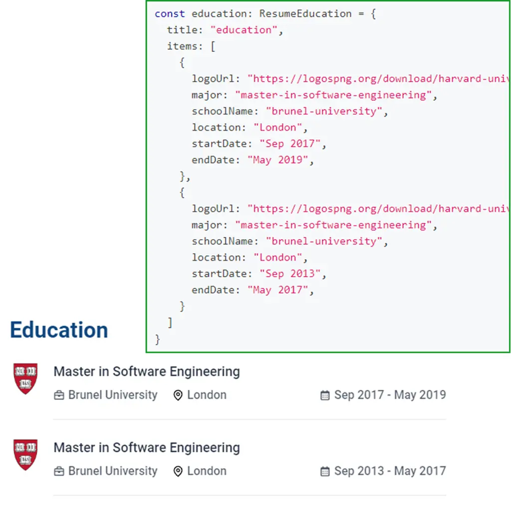

</div>

</TabItem>
</Tabs>

## Slider

<details>

<summary>Type declaration</summary>

```ts
type SliderProps = {
  images: ImgSrcSet[]
  autoPlay?: boolean
  showThumbs?: boolean
  alignment?: "left" | "right" | "expanded"
}

type ImgSrcSet = {
  mobile: string
  desktop?: string
  description?: string
}
```

</details>

<Tabs>
<TabItem value="Usage">

```tsx
import Slider from "~/components/Slider"

<Slider
  alignment="expanded"
  images={mySlides}
/>
```

</TabItem>
<TabItem value="Data">

```ts
export const mySlides = [
  {
    mobile: "/img/background/placeholder.svg",
    description: "image 1"
  },
  {
    mobile: "/img/background/placeholder.svg",
    description: "image 2"
  },
  {
    mobile: "/img/background/placeholder.svg",
    description: "image 2"
  },
  {
    mobile: "/img/background/placeholder.svg",
    description: "image 2"
  }
]
```

</TabItem>
<TabItem value="Note">

Slider could be full width or you can align it to the `left` or `right`.

```tsx
<Slider
  alignment="right"
  images={mySlides}
/>
```

```tsx
<Slider
  alignment="left"
  images={mySlides}
/>
```

</TabItem>
</Tabs>


## Testimonials

<details>

<summary>Type declaration</summary>

```ts
type TestimonialsProps = {
  testimonials: TestimonialsGroup,
  langTable: LangTable
}

type TestimonialsGroup = {
  title?: string
  description?: string
  testimonials: TestimonialItem[]
}

type TestimonialItem = {
  name: string
  title: string
  imageUrl?: string
  content: MarkdownText
}
```

</details>

<Tabs>
<TabItem value="Usage">

```tsx
import Testimonials from "~/components/Testimonials"

<Testimonials
  testimonials={testimonials}
  langTable={testimonialsLangTable}
/>
```

</TabItem>
<TabItem value="Data">

```ts
export const testimonials: TestimonialsGroup =
{
  title: "testimonials",
  description: "Commodo excepteur **exercitation** eiusmod in eiusmod ea in consequat non. Adipisicing ex cupidatat commodo fugiat do ea veniam ullamco qui aliquip officia mollit ipsum elit.",
  testimonials: [
    {
      name: "Client1",
      title: "Mr.Client1",
      imageUrl: "",
      content: "Qui culpa cillum do **eiusmod** veniam aliqua exercitation fugiat reprehenderit."
    },
    {
      name: "Client2",
      title: "Mr.Client2",
      imageUrl: "",
      content: "Qui culpa cillum do eiat **reprehenderit**. Sit aliquip qui sunt ex. Ex minim consequat sint reprehenderit ipsum consequat ex commodo dolore."
    },
    {
      name: "Client3",
      title: "Mr.Client3",
      imageUrl: "",
      content: "Qui culpa cillum do eiusmod veniam aliqua exercitation **fugiat reprehenderit**. Sit aliquip qui sunt ex. Ex minim consequat sint reprehenderit ipsum consequat ex commodo dolore."
    },
    {
      name: "Client4",
      title: "Mr.Client4",
      imageUrl: "",
      content: "Qui culpa cillum do eiusmod veniam aliqua exercitation **fugiat reprehenderit**. Sit aliquip qui sunt ex. Ex minim consequat sint reprehenderit ipsum consequat ex commodo dolore."
    },
    {
      name: "Client5",
      title: "Mr.Client5",
      imageUrl: "",
      content: "Qui culpa cillum do eiusmod veniam aliqua exercitation **fugiat reprehenderit**. Sit aliquip qui sunt ex. Ex minim consequat sint reprehenderit ipsum consequat ex commodo dolore."
    }
  ]
}
```

</TabItem>
<TabItem value="Note">

notes...

</TabItem>
<TabItem value="Screenshots">

<div style={{textAlign: 'center'}}>

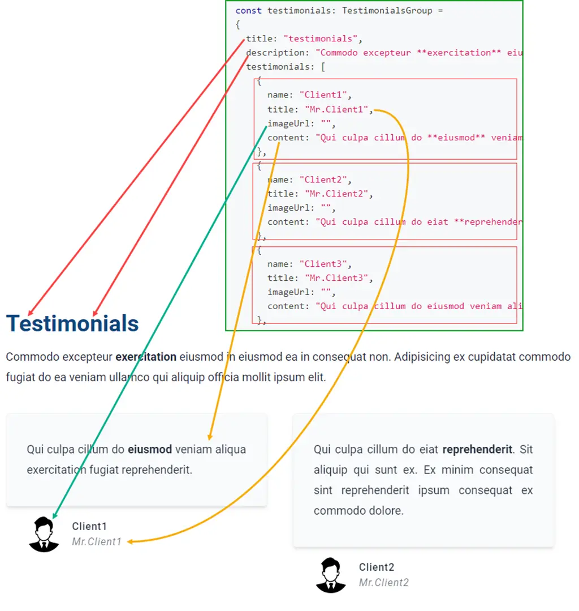

</div>

</TabItem>
</Tabs>

## Translate

<details>

<summary>Type declaration</summary>

```ts
type TranslateProps = {
  lang: Language
  children: React.ReactNode
}
```

</details>

<Tabs>
<TabItem value="Usage">

```tsx
//this block only display when current selected language is `en`
<Translate lang="en">
  Hello world
</Translate>

//this block only display when current selected language is `vi`
<Translate lang="vi">
  Xin chào!
</Translate>
```

</TabItem>
<TabItem value="Note">

`lang` is type of `Language` which is defined at `~/data/settings/config.ts`

```ts title="config.ts"
...
export type Language = "en" | "vi"
export const SUPPORTED_LANGUAGES: Language[] = ["en", "vi"]
export const DEFAULT_LANGUAGE: Language = "en"
export const CURRENCY: Record<Language, string> = {
  "en": "USD",
  "vi": "VND"
}
...
```

</TabItem>
</Tabs>

## Video

### Video.Youtube {#video-youtube}

Embed youtube video.

<details>

<summary>Type declaration</summary>

```ts
type VideoYoutubeProps = {
  /**
   * `id` of the video or playlist
   * eg: https://www.youtube.com/watch?v=8kV8KVWZYaw&list=PLCzpHpwST0xx8IxDzF82Va_rhIEcpbgW5
   *   you can use `8kV8KVWZYaw` or `PLCzpHpwST0xx8IxDzF82Va_rhIEcpbgW5`
   */
  id: string
  params?: string
  /**
   * `id` of any video within the playlist, to get the cover
   */
  playlistCoverId?: string
  /**
   * title of the video
   */
  title: string
  alignment?: "left" | "right" | "expanded"
}
```

</details>

<Tabs>
<TabItem value="Usage">

```tsx
import Video from "~/components/Video"

<Video.Youtube
  id="PLCzpHpwST0xx8IxDzF82Va_rhIEcpbgW5"
  playlistCoverId="F90ozD7peX0"
  title="Phương Ý"
  alignment="expanded"
/>
```

</TabItem>
<TabItem value="Note">

notes...

</TabItem>
<TabItem value="Screenshots">

<div style={{textAlign: 'center'}}>


</div>

</TabItem>
</Tabs>

### Video.Local {#video-local}

Play your local video files.

<details>

<summary>Type declaration</summary>

```ts
type VideoLocalProps = {
	src: string
	autoPlay?: boolean
	loop?: boolean
	muted?: boolean
	aspectRatio?: string
	className?: string
}
```

</details>

<Tabs>
<TabItem value="Usage">

```tsx
import Video from "~/components/Video"

<Video.Local
  src="video.mp4"
  autoPlay
  loop
/>
```

</TabItem>
<TabItem value="Note">

The default aspect-ratio is `16 / 9`.

</TabItem>
</Tabs>