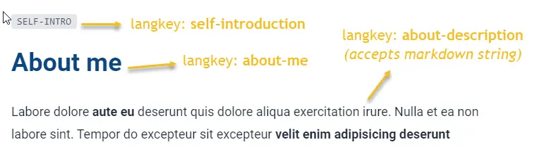

import Tabs from '@theme/Tabs';
import TabItem from '@theme/TabItem';

# About

About page is a place to tell the world about yourself. Of course, you want to show your achievements using [`Facts`](../content-blocks.mdx#facts) component. Could not miss your history of working [`Resume.Experience`](../content-blocks.mdx#resumeexperience), your education [`Resume.Education`](../content-blocks.mdx#resumeeducation)...

## Header block

Language keys used for header block of about page are `about-me`, `self-introduction`, `about-description` which located at **`app\languages\aboutLangTable.ts`**. 

<Tabs>
<TabItem value="Usage">

```tsx
<HeaderBlock
  title={t("about-me")}
  subTitle={t("self-introduction")}
  description={t("about-description")}
/>
```

</TabItem>
<TabItem value="Note">

`about-description` accepts markdown text.

</TabItem>
<TabItem value="Screenshots">

<div style={{textAlign: 'center'}}>



</div>

</TabItem>
</Tabs>

## Additional content blocks

 About page is located at **`app\routes\__layout\about.tsx`**. It is safe for you to edit the lines between the markers. 

<Tabs>
<TabItem value="File">

```ts title="app\routes\__layout\about.tsx"
...
{
  /*********************************
  * 
  *   START PAGE CONTENT 
  * 
  ********************************/
}

//place your content for homepage here

{
  /*********************************
  * 
  *   END PAGE CONTENT 
  * 
  ********************************/
}
...
````

</TabItem>
<TabItem value="Content blocks">

Recommended content blocks for your about page

- [Markdown](../content-blocks.mdx#markdown)
- [Picture](../content-blocks.mdx#picture)
- [Facts](../content-blocks.mdx#facts)
- [Resume](../content-blocks.mdx#resume)
  + [Resume.Experience](../content-blocks.mdx#experience)
  + [Resume.Education](../content-blocks.mdx#education)
- [Testimonials](../content-blocks.mdx#testimonials)

or you can use following blocks to enrich your about page

- [Features](../content-blocks.mdx#features)
  + [Features.Simplicity](../content-blocks.mdx#featuressimplicity)
  + [Features.Blocks](../content-blocks.mdx#featuresblocks)
  + [Features.Picture](../content-blocks.mdx#featurespicture)
  + [Features.Art](../content-blocks.mdx#featuresart)

</TabItem>
<TabItem value="Examples">

```tsx
<Picture
  src="https://placeimg.com/192/192/people"
  alignment="right"
  rounded="xl"
  oneThird
/>

<Markdown
  markdown={t("about-me...",[YOUR_NAME.text])}
/>

<Facts
  facts={factsInAbout}
  langTable={factsLangTable}
/>

<Resume.Experience
  resume={experiences}
  langTable={resumeLangTable}
/>

<Resume.Education
  resume={education}
  langTable={resumeLangTable}
/>

<Features.Simplicity
  features={mySkills}
  langTable={skillsLangTable}
/>

<Features.Art
  features={mySkills}
  langTable={skillsLangTable}
/>

<Features.Blocks
  features={mySkills}
  langTable={skillsLangTable}
/>

<Testimonials
  testimonials={testimonials}
  langTable={testimonialsLangTable}
/>
```

</TabItem>
</Tabs>

## Video tutorial

```mdx-code-block
import LiteYouTubeEmbed from 'react-lite-youtube-embed';

<div className="video-container">
  <LiteYouTubeEmbed
    id="YEFoHFK5ydU"
    playlist={false}
    title="Introduction about About page"
    poster="hqdefault"
    noCookie={true}
  />
</div>
```