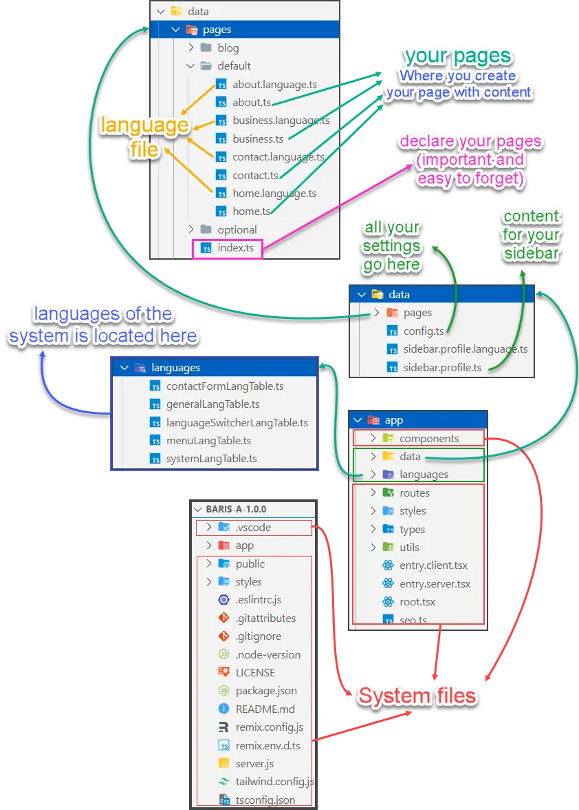

# Files structure

## Structure

:::info

- **System Pages (in red)**: do not touch these files and folders unless you know what you are doing
- **User Pages (not in red)**: where you do the modification. You often need to read [content blocks](../guides/content-blocks.mdx) to know the structure of content blocks. To use them correctly.

:::

Who do I say that **Baris is simple and easy**? That is because you only need to touch 2 folders. They are `data` and `languages`:

- `languages folder`: this is used for the translation of system text. You rarely touch this folder after your installation.
- `data folder`: all your data go here. This is where you do your job. But it is still simple, for you only need to do 2 steps for a page.
  + Create your page (file) by duplicate any existed file `.ts`.
  + Create your language file by duplicate any existing language file `.language.ts` (optional) 
  + Declare your page in `app\data\pages\index.ts`

