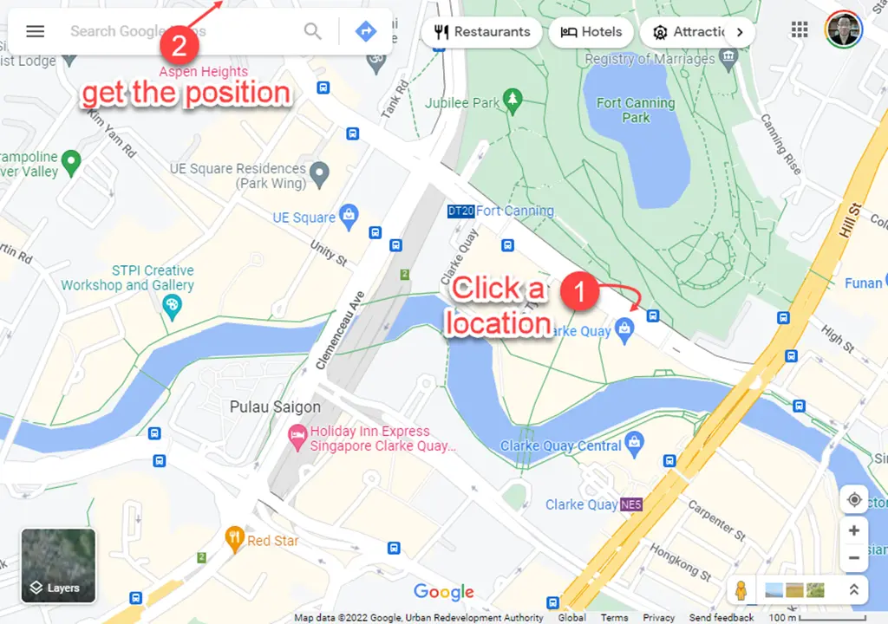

import BrowserWindow from '@site/src/components/BrowserWindow';

# FAQs

Frequently asked questions about **`Baris-A`**

<details>
<summary>I get lost, I don't know what to do!</summary>

Great to see you here! We can summarize all activities related to Baris-A as below:

1. You [purchased Baris-A](https://store.chasoft.net/l/baris-a-serverless-template-for-personal-website) 😘😍
2. You [set up local development environment](./installation.md)
3. You [update the configuration](./configuration.md) of the application 🔥 *(you would come back to this step to do updating your site's settings to fit your requirements and/or requirements)*.
4. You take a look at [Baris-A' files structure](../advanced-guides/files-structure.mdx)
5. You read all articles in [guides section](../../baris-a/guides)
6. You start experimenting to update Baris-A locally 🔥 *(this would take a lot of time or if you want to avoid spending your time, then, contact me to spend your money 😅)*
7. When you have any questions, try to find in our [documentation](../../baris-a), or ask me via [email](mailto:support@chasoft.net). Or if you need the highest support priority, you can check my subscription package [Telegram Support Channel for Baris-A](https://store.chasoft.net/l/telegram-support-channel-for-ari) which will allows you to ask for support via Telegram.
8. Finally, you [deploy your website to Cloudflare](../guides/deployment.md) ✈🎉.

I know that you would need many efforts. That's why we say *"**build** your website"*. When everything is well done. You need to update your website regularly and build your great online presence to support your business 💯 or personal interests 💯.

Updating Baris-A is much more simple.

1. Open Visual Studio Code
2. Do the update: add new blog post, or new portfolio article, or new announcements, or new notes, or new updates.
3. Run `npm run dev` to preview your changes locally.
4. Go to `Source Control` panel *(Ctrl+Shift+G)* > for changes files, select all and choose `Stage changes` from popup menu > write some notes > Click `Commit` button to commit changes to local repository> Click `Sync Changes` button to upload changes to GitHub.

That's all. When you **sync changes** to GitHub, Cloudflare Pages will automatically deploy your changes. Basically, you will need to deal with updating Baris-A and commit to GitHub. The deployment is automatic 😎⚡.

</details>

<details>
<summary>Why must I use a `private GitHub` repository for Baris-A?</summary>

**Baris-A is not an open-source software**. So, please kindly keep your GitHub repository be `private`, or your repository would be taken down by the [DCMA policy](https://en.wikipedia.org/wiki/Defense_Contract_Management_Agency) and your license would be rejected.

</details>

<details>
<summary>Why the name of you product is `Baris-A`, not `Baris`?</summary>

Baris is a series of serverless template. The very first item is `Baris-A` for Personal Website! I will publish a lot of template for all your needs soon.

They would be: `Baris-B`, `Baris-C`, `Baris-D`, `Baris-H`,...

</details>

<details>
<summary>Where can I deploy my Baris-A?</summary>

**Baris-A** could be ported to run on any serverless platform _(thanks to [Remix Web Framework](https://remix.run/))_ such as:

* AWS
* Cloudflare worker
* FlyIo
* Netlify
* Vercel
* Any Express server

but for the very first version of **Baris-A** _(1.x)_, we only support to deploy to **`Cloudflare Pages`**. The reason is that **Baris-A** (1.x) focus on `standalone spirit` and `affordable spirit`. You would have a beautifyl Serverless Personal Website for `FREE` when deploy to `Cloudflare Pages`

In my experience, Cloudflare Pages is the best provider for such application as Baris-A.

</details>

<details>
<summary>How to get the `latitude` and `longitude` of a location?</summary>

To mark the location on [the map](../guides/content-blocks.mdx#map), you must provide a `latitude` and `longitude` numbers.

You can use Google Map and, select a location on the map and you will have the anchor

<BrowserWindow
  url={
    <span>
      .../Clarke+Quay/@
      <span style={{ fontWeight: "bold", color: "red" }}>1.29105,103.8439817</span>
      ,
      <span style={{ fontWeight: "bold", color: "blue" }}>17</span>
      z/data=!3m1!5s0x31...
    </span>
  }
>

<div style={{textAlign: 'center'}}>



</div>

</BrowserWindow>

```
  anchor = [1.29105, 103.8439817]
  zoom = 17
```


</details>