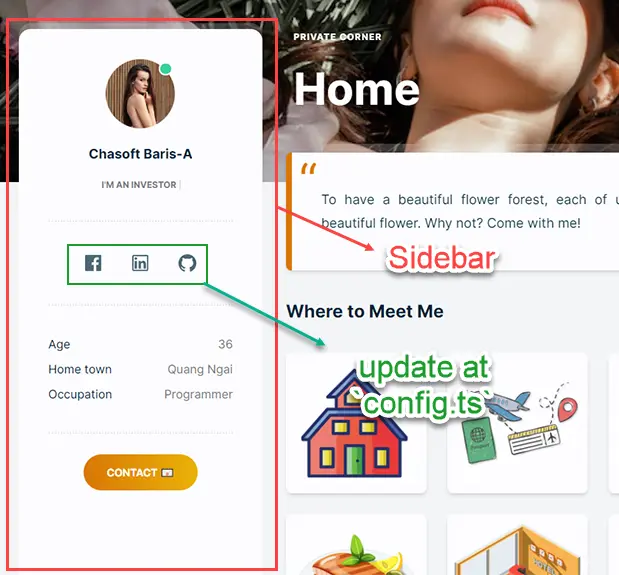

# Sidebar

## Sidebar

Sidebar is an important block of Baris-A. All data is located at `app\data\sidebar.profile.ts` and you can update the language at `app\data\sidebar.profile.language.ts`.

<div style={{textAlign: 'center'}}>



</div>

### Social links

For **social links**, let you update at `app\data\config.ts`

```ts
...
export const SOCIAL_LINKS: IconProps[] = [
	//update your social links here	
]
...
```