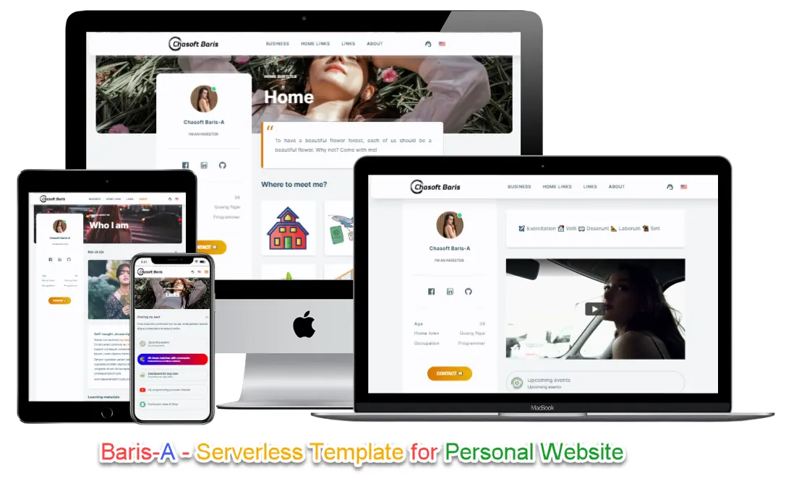

# Introduction

<div style={{textAlign: 'center'}}>



</div>

⚡️ Baris-A is a serverless template to ship your personal website. It is **lightning fast**, **beautiful**, **independent** and stay alive for **free** with free-tier of Cloudflare Pages.

💯 **15+ content blocks** which helps you express any essential information for your personal website.

💸 Support **i18n** _(internationalization)_ by default. It is great to have your website in multi-languages.

🧐 Baris-A is a **Server-side Rendering** website. It builds a **multi-pages application** with fast client-side navigation, leveraging the full power of **React** to make your site interactive *(has ability to **share any corner** of your personal website)*.

🤑 Deploy to Cloudflare Pages for **free** - no monthly fee, no annual fee.

## Baris-A: Serverless Template for Personal Websites

In this video, the author will show you a brief introduction about Baris-A and its features.

```mdx-code-block
import LiteYouTubeEmbed from 'react-lite-youtube-embed';

<div className="video-container">
  <LiteYouTubeEmbed
    id="YEFoHFK5ydU"
    playlist={false}
    title="Baris-A: Serverless Template for Personal Websites"
    poster="hqdefault"
    noCookie={true}
  />
</div>

```
## Features {#features}

Baris-A is built with high attention to `standalone application` which all data are stored in GitHub repository, no database, no backup, but still having the power of dynamic websites. Thanks to [Remix Web Framework](https://remix.run).

- 💯 **Fully-dynamic website**: you create your pages under `text file format`. That's all. You don't have to deal will coding as [Aris](http://store.chasoft.net/l/ari-elegant-and-powerful-serverless-website) _(but Aris is full-featured and powerful Serverless Applications)_
- 🎯 **SEO-friendly**
  - **Server-side rendering** *(SSR)* is SEO friendly.
  - **High performance** with very high Page Speed scores.
- 📝 **Powered by Markdown**
  - Write your text in `Markdown format` or in plain text.
  - **20+** content components for your arrangement with ideas.
- 🌍 **Internationalization (i18n)**
  - Translate your site in multiple locales, the easy way.
- ⚛️ **Built with 💚 and [Remix](https://remix.run)**
  - Extendable and customizable with React
  - Working with/without JavaScript enabled.
  - **Standalone** website

Baris-A is born to be a better personal website for everyone: `Simple`, `Dynamic` and `lightning-fast`.

- ⚡️ **Lightning-fast**. Baris-A is built using Remix Web Framework, focus in web fundamentals.
- 🦖 **Accessible**. Attention to accessibility, making your site equally accessible to all users.

## Why Baris-A? {#why-baris}

- Built by **Remix Web Framework**. Great framework to build better website and apps.
- **20+** content blocks. All fully documented with guides and video tutorials.
- Fully support **multi-languages** *([i18n](https://en.wikipedia.org/wiki/Internationalization_and_localization))*
- You **don't need to learn about web-development** when working with Baris-A to build your own personal website *(great for everyone)*
- We provide **add-on services** such as installation, setup, customization...

Finally, you would have a very fast ⚡ website which helps you to express everything *(oh, your real personal website)* to support your job, your personal business, your personal interests. You are confident 😎 to have a name card with only your name and a domain on it, and say: *"let you check my website for details"*.

Visit **[our store](https://store.chasoft.net/l/baris-a-serverless-template-for-personal-website)** and **purchase a license** to start your online presence today.

## Is something missing? {#something-missing}

If you find issues with the documentation or have suggestions on how to improve the documentation or the project in general, please [file an issue](https://github.com/chasoft/docs.chasoft.net) for us, or send a tweet mentioning the [@vBizChain](https://twitter.com/vBizChain) Twitter account.

For new feature requests, you can create a [new issue](https://github.com/chasoft/docs.chasoft.net/issues/new/choose), which is a handy tool to track todos, bugs, feature requests, and more. As issues are created, they'll appear here in a searchable and filterable list.